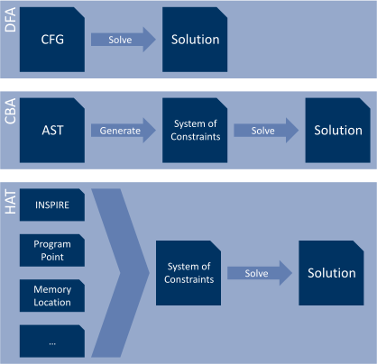

# Static Code Analysis

This chapter provides a concise introduction to the topic of static program analysis with a focus on Data-Flow Analysis (DFA) and its extension, the *constraint-based approach*.
It serves as a stepping stone to communicate the theoretical background for the following chapters.

It starts off with a few words about the general purpose of static code analysis and continues with the introduction of the Control-Flow Graph (CFG).
After that the general concept of DFA is communicated together with a *reaching definitions* example.
Finally, the constraint-based approach is tackled and applied to the same example for comparison.
The chapter concludes with an overview of customisations made by @herbert_phd to the Constraint-Based Analysis (CBA) framework.

## Purpose

Static code analysis is about deducing *properties* of a program without actually running the program.
This happens typically in a compiler during the optimisation stage.
Yet there are also other tools (referred to as static code analysers) which can run various checks on the code and extract properties from it.
Checking for nullpointer dereferences, dead code, and estimating runtime complexity are just a few examples for checks, that can be conducted by an analysis.
In case of a compiler, an optimisation commonly consists of an analysis identifying structures in the program suitable for optimisation, followed by a transformation of that structure into one that yields better performance^[Depending on the current objective, performance can refer to runtime, memory usage, power consumption, etc.].
Static code analysers are often used to identify bugs (eg race conditions, iterator invalidation, etc) not caught by the compiler.
But they can also be useful to extract program properties for later use (eg auto-tuning).

As already mentioned, this introduction section focuses on DFA, which is a *flow-sensitive* technique.
Meaning, we take the control-flow of the input program into account at the time the analysis is performed.
This leads to a more accurate result, but also requires a greater computational effort.
*Flow-insensitive* analyses, on the other hand, are much faster.
However, they yield less accurate results in the form of over-approximations.
Since knowledge about flow-insensitive analysis is not required for this task, these kinds of techniques are not elaborated further.

There are, of course, different techniques how one could construct a DFA.
And while some of them provide clear benefits over others, they sometimes also suffer drawbacks.
But what (nearly) all of them have in common is the utilisation of CFGs.
The following section introduces those.

## Control-Flow Graph

The control flow of a program can be abstracted as a graph, in which each node represents a *basic block*.
A basic block is a sequence of instructions without any jumps or jump targets (ie labels) in-between.
It commonly begins with a jump target and ends with a jump instruction.
Basic blocks are connected via directed edges, which represent potential execution paths.
An edge that points to an already visited block during depth-first traversal is referred to as a *backward edge* and frequently introduced by a loop.
Adding two additional empty blocks, the *entry block* and *exit block*, can help keeping algorithms operating on the graph simple.
All control-flows start at the entry block and end at the exit block [@wiki:cfg].

What exactly constitutes a node of the CFG is not set in stone and varies depending on the application.
While the textbook definition concerns itself with basic blocks, one could easily abstract away whole functions into a graph's nodes.
Based on the application, attaching additional information to the edges can be helpful too.

The code snippet below displays a short C program with three functions.
@fig:cfg illustrates the corresponding CFG.
Each function features a dedicated entry node annotated with the function’s name and an exit (`return`) block.
The example contains branching as well as loops.

```{.c .numberLines}
/* File: cfg.c */

#include <stdio.h>
#include <stdlib.h>

void print_something(int times) {
	for (int i = 0; i < times; ++i) {
		puts("something");
	}
}

void print_usage() {
	puts("some usage");
}

int main(int argc, char* argv[]) {
	if (argc < 2) {
		print_usage();
		return EXIT_FAILURE;
	}
	print_something(atoi(argv[1]));
	return EXIT_SUCCESS;
}
```

{#fig:cfg}

During a program analysis run certain properties are tracked across the nodes.
These properties (eg reaching definitions) are recorded when a node is entered and left.
These records are referenced by the labels of the related graph node together with either $\mathrm{in}$ or $\mathrm{out}$.

For instance, $\mathrm{REACH}_{\mathrm{in}}[S]$ and $\mathrm{REACH}_{\mathrm{out}}[S]$ are the reaching definitions recorded at the entry point and exit point respectively of the graph node $S$.
This notation is often shortened to $\mathrm{in}(S)$ / $\mathrm{out}(S)$ if the specific analysis can be derived from the current context [@wiki:reaching_definition].

## Data-Flow Analysis

In this section the basis of Data-Flow Analysis is described.
The description itself is keep very informal and is presented through an example.

A Data-Flow Analysis (DFA) is a static program analysis used to extract certain properties (eg *reaching definitions* or *live variables*) from a program.
Traditionally, DFA assumes a given control-flow of the program -- and while one could work on the Abstract Syntax Tree (AST) -- using a CFG is often much simpler and yields similar outcome (with respect to accuracy regarding DFA) [@slides:dataflow].
This technique can be cast into a framework as presented in the remainder of this document.

Furthermore, there are two ways an analysis can operate.
It can either be a *must analysis* or a *may analysis*.
A must analysis requires that a property must hold in all branches to be still considered after a meeting point (logical and).
Alternatively, in a *may analysis* a property is considered after a meeting point if it holds in at least one branch (logical or).
An example for a *must analysis* would be *available expressions* [@slides:dataflow], while *reaching definitions* (see [Reaching Definitions Example]) is a *may analysis*.

Most DFA frameworks only yield sound solutions if the domain of the property space forms a *lattice*.
Because of this, we now take a short detour and glance at the mathematical concept of a lattice.

### Lattice

{#fig:lattice}

A complete lattice is an algebraic structure which consists of a partially ordered set in which every two elements share a unique upper bound (*join*) and a unique lower bound (*meet*).
Furthermore there exists one element $\bot$ that is smaller, and one element $\top$ that is larger than every other element in the set.
The purpose of the lattice, with respect to program analysis, is to model a domain of program properties.
The *height* of a lattice is given by the longest path through partial order from greatest to least.
Elements of the lattice represent flow values ($\mathrm{in}$ and $\mathrm{out}$ sets) while $\bot$ and $\top$ represent the *best-case* and *worst-case* information respectively.
The *meet* operator $\sqcup$ describes how two flow values are merged [@wiki:lattice; @slides:lattice; @slides:lattice2].

@fig:lattice shows an example application for a lattice where three variables $i$, $j$ and $k$ are given.
A flow value can exhibit any combination of them.
Hence the $\top$ and $\bot$ value can be mapped to the set of all variables and $\emptyset$ respectively.
The height of the lattice, $4$, which can be immediately deduced from the illustration and the ordering of the lattice ($\sqsubseteq$) is mapped to $\subseteq$.
This representation is known as a *Hasse Diagram* [@wiki:hasse_diagram].

There exists also the concept of a *semilattice*, which resembles a normal lattice, but only features *either* a least upper bound *or* greatest lower bound, known as *join-semilattice* or *meet-semilattice*, respectively.

The interested reader is encouraged to take a look at the more comprehensive introduction to lattices provided by @lattice_tutorial.

### Reaching Definitions Example

A definition of a variable at program point $p_1$ *reaches* program point $p_2$ if there is a control-flow path from $p_1$ to $p_2$ along which the variable defined by $p_1$ is not redefined.
Positive and negative examples are provided [@wiki:reaching_definition].

    p1: x = 42                                             p4: z = 24
    p2: y = 12                                             p5: z = 16
    p3                                                     p6

The definition of $x$ from $p_1$ reaches the program point $p_3$.
The definition of $z$ from $p_4$ does not reach $p_6$. It is \emph{killed} by the definition at $p_5$.

#### Lattice

Before concerning ourselves with the DFA itself, we have to define the lattice of the property we would like to obtain.
Let $V$ be the set of all variables, $S = \{0, 1, \ldots\}$ the set of all statements in the CFG and $L = S \cup \{?\}$.
The lattice is then given by $$(2^{V \times L},\subseteq)$$ '$?$' is used to represent an input to the program.
From this, $\bot = \emptyset$ and $\top = V \times L$ can be derived.
Since the elements of $V$ and $L$ are ordered, we can also derive an order for $V \times L$.
The join and meet operators can be mapped to $\cup$ and $\cap$ respectively.

#### Data-Flow Analysis

The data-flow equations for calculating reaching definitions are: for all basic blocks $b$ of a given CFG,

\begin{align*}
  \mathrm{in}(b)  &= \bigcup_{p \in \mathrm{pred}(b)} \mathrm{out}(p) \\
  \mathrm{out}(b) &= \mathrm{gen}(b) \cup (\mathrm{in}(b) \setminus \mathrm{kill}(b))
\end{align*}

where $\mathrm{gen}(b)$ is the set of definitions contained in block $b$, $\mathrm{kill}(b)$ the set of definitions *killed* in block $b$ and $\mathrm{pred}(b)$ is the set of predecessors of $b$.
*Killing* a definition means that it is no longer available in subsequent blocks, as illustrated in the initial example of this subsection.

Let us take the following program computing $x!$ together with the corresponding CFG in @fig:factorial.
Note that we only focus on the calculating part here and assign each statement its own block for simplicity.
This example is based on the introduction provided by @Nielson:ppa.

```{.c .numberLines}
/* File: factorial.c */

#include <stdio.h>
#include <stdlib.h>

int factorial(int x) {
	int y = x;
	int z = 1;
	while (y > 1) {
		z = z * y;
		y = y - 1;
	}
	y = 0;
	return z;
}

int main(int argc, char* argv[]) {
	int x = atoi(argv[1]);
	printf("%d! = %d\n", x, factorial(x));
	return EXIT_SUCCESS;
}
```

{#fig:factorial}

Running a reaching definition analysis on this code results in the following twelve equations, two for each block.

\begin{align*}
  \mathrm{in}(1) &= \{(x,?)\}                            & \mathrm{out}(1) &= \{(y,1)\} \cup (\mathrm{in}(1) \setminus \{(y,l) \mid l \in L\}) \\
  \mathrm{in}(2) &= \mathrm{out}(1)                      & \mathrm{out}(2) &= \{(z,2)\} \cup (\mathrm{in}(2) \setminus \{(z,l) \mid l \in L\}) \\
  \mathrm{in}(3) &= \mathrm{out}(2) \cup \mathrm{out}(5) & \mathrm{out}(3) &= \mathrm{in}(3) \\
  \mathrm{in}(4) &= \mathrm{out}(3)                      & \mathrm{out}(4) &= \{(z,4)\} \cup (\mathrm{in}(4) \setminus \{(z,l) \mid l \in L\}) \\
  \mathrm{in}(5) &= \mathrm{out}(4)                      & \mathrm{out}(5) &= \{(y,5)\} \cup (\mathrm{in}(5) \setminus \{(y,l) \mid l \in L\}) \\
  \mathrm{in}(6) &= \mathrm{out}(3)                      & \mathrm{out}(6) &= \{(y,6)\} \cup (\mathrm{in}(6) \setminus \{(y,l) \mid l \in L\})
\end{align*}

Each pair consists of a variable ($x$, $y$ or $z$) and a label, where the label is either the number of the block or '$?$' if the variable is not initialised within this context.
Uninitialised variables can be considered input to the program.
When focusing on block $3$ one can see that the information flowing into the block is the same as the information flowing out of the block since no variables are modified.
At block $3$ two different control-flows meet yielding a merge of facts.

One can observe a different result for the first equation when comparing it to the original source of this example.
This change results from the way this example is presented.
In our case the two variables $y$ and $z$ do not exist prior to executing the algorithm, hence the analysis does not need to consider them as input [@Nielson:ppa, p. 7].

As stated by @Nielson:ppa, only a finite number of solutions exist for the derived system of equations.
Furthermore each of these solutions is a *fixed point* and all of them are partially ordered.
Most interestingly, the *least fixed point solution*, obtained this way, contains the fewest pairs of reaching definitions.
Therefore this is the most accurate result, and the one we are interested in.
It looks as follows:

\begin{align*}
  \mathrm{in}(1) &= \{(x,?)\}                             & \mathrm{out}(1) &= \{(x,?), (y,1)\} \\
  \mathrm{in}(2) &= \{(x,?), (y,1)\}                      & \mathrm{out}(2) &= \{(x,?), (y,1), (z,2)\} \\
  \mathrm{in}(3) &= \{(x,?), (y,1), (y,5), (z,2), (z,4)\} & \mathrm{out}(3) &= \{(x,?), (y,1), (y,5), (z,2), (z,4)\} \\
  \mathrm{in}(4) &= \{(x,?), (y,1), (y,5), (z,2), (z,4)\} & \mathrm{out}(4) &= \{(x,?), (y,1), (y,5), (z,4)\} \\
  \mathrm{in}(5) &= \{(x,?), (y,1), (y,5), (z,4)\}        & \mathrm{out}(5) &= \{(x,?), (y,5), (z,4)\} \\
  \mathrm{in}(6) &= \{(x,?), (y,1), (y,5), (z,2), (z,4)\} & \mathrm{out}(6) &= \{(x,?), (y,6), (z,2), (z,4)\}
\end{align*}

## Constraint-Based Analysis

Previously we dealt with the extraction of multiple equations from a CFG by traversing it, and then solving a system of equations to derive information (ie facts) about the program.
The main idea behind the constraint-based approach is to directly extract these constraints and handle them explicitly, instead of implicitly handling equations given by the structure of the CFG.
Due to the explicit handling of these constraints the two processes of generating and solving them can be separated, resulting in a *constraint generator* and *constraint solver* [@Nielson:ppa; @herbert_phd].

We continue straight on with the example of the previous section to demonstrate the differences between the mentioned two approaches.

### Reaching Definitions Example (cont)

Taking the constraint-based approach, the following list of constraints can be derived from the previous example -- see @fig:factorial.
Note that the format of constraint may be more complex (eg conditions), depending on the scenario.
They may also be derived from other sources than the CFG (eg an AST).

\begin{align*}
  \mathrm{out}(1) &\supseteq \mathrm{in}(1) \setminus \{(y,l) \mid l \in L\} &
  \mathrm{out}(1) &\supseteq \{(y,1)\} \\
  \mathrm{out}(2) &\supseteq \mathrm{in}(2) \setminus \{(z,l) \mid l \in L\} &
  \mathrm{out}(2) &\supseteq \{(z,2)\} \\
  \mathrm{out}(3) &\supseteq \mathrm{in}(3) \\
  \mathrm{out}(4) &\supseteq \mathrm{in}(4) \setminus \{(z,l) \mid l \in L\} &
  \mathrm{out}(4) &\supseteq \{(z,4)\} \\
  \mathrm{out}(5) &\supseteq \mathrm{in}(5) \setminus \{(y,l) \mid l \in L\} &
  \mathrm{out}(5) &\supseteq \{(y,5)\} \\
  \mathrm{out}(6) &\supseteq \mathrm{in}(6) \setminus \{(y,l) \mid l \in L\} &
  \mathrm{out}(6) &\supseteq \{(y,6)\}
\end{align*}

Upon close investigation of this list and the original program, a pattern emerges.
Every time a variable is assigned, two constraints are generated.
One for excluding (*killing*) all pairs generated by prior assignments of this variable, and one for adding (*generating*) a new pair corresponding to this assignment.
Otherwise, if no variable is assigned, everything is simply passed through.

Note the similarities of this discovered pattern and the original dataflow equations:

\begin{align*}
  \mathrm{out}(b) &= \mathrm{gen}(b) \cup (\mathrm{in}(b) \setminus \mathrm{kill}(b)) && \text{Dataflow equation} \\[-0.5em]
  \cline{1-4}
  \mathrm{out}(b) &\supseteq \mathrm{gen}(b) && \text{Constraints} \\
  \mathrm{out}(b) &\supseteq \mathrm{in}(b) \setminus \mathrm{kill}(b)
\end{align*}

Nevertheless, these constraints only tell us how information flows *through* each block, we are still missing how information flows *between* blocks.
Therefore the following list is derived.

\begin{align*}
  \mathrm{in}(2) &\supseteq \mathrm{out}(1) \\
  \mathrm{in}(3) &\supseteq \mathrm{out}(2) & \mathrm{in}(3) &\supseteq \mathrm{out}(5) \\
  \mathrm{in}(5) &\supseteq \mathrm{out}(4) \\
  \mathrm{in}(6) &\supseteq \mathrm{out}(3)
\end{align*}

Again a pattern is immediately visible: each edge in the CFG results in a constraint connecting the exit set of a block with the entry set of its successor.

The last constraint we need relates to the input of our program.
$$\mathrm{in}(1) \supseteq \{(x,?)\}$$

Finally, the same solution obtained in the data-flow analysis approach is also valid for this system of constraints.
In fact, it is also the least solution [@Nielson:ppa, p. 10].

## Insieme CBA framework

The constrained-based approach, as presented by @Nielson:ppa, resembles a generic framework suitable for various kinds of analysis.
While we only focused on reaching definitions for now, other kinds (eg live variable analysis) can be realised in a similar fashion.

{#fig:hat_vs}

In @fig:hat_vs the core difference between DFA, CBA and our HAT are illustrated.
In DFA a system of equations is implicitly derived from the CFG and immediately solved to obtain a valid solution for an analysis.
In CBA the generation and solving of constraints is replaced by two stages: first generating a system of constraints and solving the system afterwards.
Both stages are clearly separated and the second is initiated *after* the first one is completed.
HAT on the other hand, relaxes the strict design of two separated stages.
This is made possible by the introduction of a lazy constraint solver [@herbert_phd].

The lazy constraint solver allows the toolkit to generate constraints on the fly, as needed, and to inject them into the system of constraints during an analysis run.
Furthermore, HAT is not limited to using an (annotated) CFG.
As already hinted in the introduction to this chapter, not all analyses operate on a CFG.
Instead, they could directly use an AST or their own custom data structure.

Using the INSieme Parallel Intermediate REpresentation (INSPIRE) together with additional sources of information, including but not limited to Program Points and Memory Locations, analyses can be more flexible and can output more accurate results than by just using a CFG.
In general, the framework allows multiple different structures to be associated with *analysis variables*.
Also, the extraction of a CFG from an AST can be skipped.
In particular, this design enables the unification of control- and data-flow problems, facilitating the computation of the actual (inter-procedural) flow of control as part of the DFA.

The design of the modified CBA framework, including lots of details and examples, can be found in [@herbert_phd, pp. 198--289].
Certain parts have been cherry-picked and summarised in the remainder of this section.

### Property Space

A property space consists of a domain, representing all possible values a property may exhibit and a *combination operator*.
The operator is used to merge the results of different control-flow paths considered by the analysis [@herbert_phd, p. 187].
Using the reaching definitions example, presented previously, the property
space would be given by $$(2^D,\bigcup\nolimits_{\mathrm{D}})$$ where

\begin{align*}
  D &= V \times L \\
  \bigcup\nolimits_{\mathrm{D}}: 2^D &\to D \\
  \{d_1, d_2, \ldots, d_N\} &\mapsto \bigcup_{1 \leq i \leq N} d_i
\end{align*}

Each property space is inducing a lattice $(D, \subseteq)$ by defining $a \subseteq b \Longleftrightarrow b = \bigcup\,\{a, b\}$.
Thus, $\bot = \bigcup \emptyset$ and $\top = \bigcup D$.

### Analysis Variables

Analysis variables are given by a pair connecting the type of analysis (eg arithmetic value) and some id associated with an element of an underlying structure.
For example, given the labelled expression $[[7]^1 + [4]^2]^3$ where the labels are written in superscript, the variable $A(3)$ refers to the *arithmetic value* of the expression labelled $3$.
This would lead to the following set of constraints.

\begin{align*}
  \{7\} & \subseteq A(1) \\
  \{4\} & \subseteq A(2) \\
  \{x + y \mid x \in A(1),\ y \in A(2)\} & \subseteq A(3)
\end{align*}

### Assignment

An assignment maps each analysis variable to a value of the corresponding property space.
At the beginning of an analysis each analysis variable is initialised with the $\bot$ value of the respective property space.
The solver (see below) modifies this mapping until all constraints are satisfied.
The final assignment corresponds to the (least) solution of the system of constraints.

### Constraint Guards

A detail omitted in the previous example is the option of having *conditional constraints*.
These are, in other words, *guarded* constraints which are only considered if their *guard* evaluates to true.
Taking one of the previous constraints we encountered out of context and attaching a random guard, just for the sake of it, gives us the following expression

$$x = 4 \wedge y < 2 \mathrel{\;\Longrightarrow\;} \mathrm{in}(4) \setminus \{(z,l) \mid l \in L\} \supseteq \mathrm{out}(4)$$

, where $x = 4 \wedge y < 2$ is the guard and $\mathrm{in}(4) \setminus \{(z,l) \mid l \in L\} \supseteq \mathrm{out}(4)$ is the constraint.
Also, the term on the right of the $\supseteq$ operator must be a single variable -- the constraint or target variable.

Constraints without an explicit guard can be viewed as one with a guard that is always true.

### Constraint Generator

A constraint generator constructs new analysis variables and constraints.
The constraints are attached to the variable and may depend on other analysis variables.
Hence connections (ie dependencies) between variables are established.
For new analyses, a constraint generator must be provided.
It hooks into the framework and is used for the corresponding analysis.
The framework already comes with some analyses and therefore their related property spaces and constraint generators.
They can be used as a starting point for new analyses.

### Analysis

An analysis combines a given property space with a constraint generator.
It (and its variables) are distinguished from other analyses (and their variables) by an identifier.
Already mentioned examples have been $A$, $\mathrm{REACH}_\mathrm{in}$, and $\mathrm{REACH}_\mathrm{out}$.

### Constraint Solver

As presented by @Nielson:ppa, the solver was required to have a *complete* set of constraints from the get go.
The modifications made by @herbert_phd include a *lazy-solver* capable of incorporating constraints during the solving process.
Furthermore, this addition enables analyses to be more flexible since they can take temporary results into account -- partial solutions obtained by the solver can influence the generation process of new constraints.

Additionally, in the original framework constraint guards were required to be *monotone* predicates.
With the new *local restart* feature this restriction can be relaxed.
This enables the analysis to make assumptions.
This can lead to more accurate results, if the assumptions turn out to be valid.
But results obtained from an assumption that turns out to be invalid need to be *forgotten* through resetting a set of interdependent analysis variables.
This mechanism works fine as long as reset-events do not repeatedly trigger each other^[This problem does not occur if the constraint set is *stratifiable*.] [see @herbert_phd, pp. 216].

The constraint solver itself is a fixpoint solver which utilises worklists.
The algorithm initialises the assignment with the property spaces' $\bot$ values and updates it step by step until all constraints are satisfied.
[Solver] covers its internal working.
