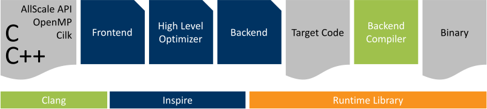
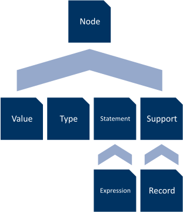
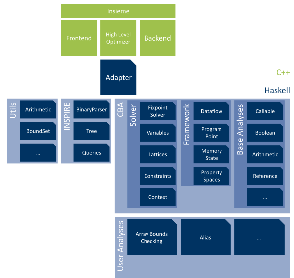

# Architecture

This chapter provides a grand overview of the system's architecture.
It starts with a brief outline of the Insieme project and continues with investigating the INSieme Parallel Intermediate REpresentation (INSPIRE).
Next, each module of the toolkit is described shortly by summarising its purpose.

## Insieme

The Insieme project is split into two parts, the Insieme compiler and the Insieme Runtime.
Both are designed in such a way that they can also be used separately.
@fig:insieme_compiler displays the typical pipeline where the compiler is combined with the runtime library.
Insieme's mission statement follows [@insieme.org].

{#fig:insieme_compiler}

> Parallel computing systems have become omnipresent in recent years through the penetration of multi-core processors in all IT markets, ranging from small scale embedded systems to large scale supercomputers.
> These systems have a profound effect on software development in science as most applications are not designed to exploit multiple cores.
> The complexity in developing and optimizing parallel programs will rise sharply in the future, as many-core computing systems become highly heterogeneous in nature, integrating general purpose cores with accelerator cores.
> Modern and in particular future parallel computing systems will be so complex that it appears to be impossible for any human programmer to effectively parallelize and optimize programs across architectures.
>
> The main goal of the *Insieme project* of the *University of Innsbruck* is to research ways of automatically optimizing parallel programs for homogeneous and heterogeneous multi-core architectures and to provide a source-to-source compiler that offers such capabilities to the user.

Insieme's Runtime maintains a set of worker threads to concurrently processing tasks.
It knows about the system architecture and can take records of previously run programs for scheduling and optimisation decisions into account.
We won't concern ourselves with the runtime any further since no interaction with it is required for this work.

Insieme's compiler is a source-to-source compiler taking C/C++ code as input and generating standard C++11 code as output (optionally with [OpenCL](https://www.khronos.org/opencl).
Along with this, the frontend accepts the [AllScale API](http://www.allscale.eu), [OpenMP](http://www.openmp.org) and [Cilk](https://www.cilkplus.org) for parallelism.
An important aspect of Insieme is that it is built as a framework, not just a single compiler with a fixed set of options.
This design decision keeps Insieme's architecture modular and prevents interference between modules.

Despite resembling a framework, the design is still similar to other compilers.
It consists of a frontend, a backend and some complex parts in-between them.
The frontend's purpose is to validate and transform input code into INSPIRE.
The original input code is no longer needed after transformation.
The INSPIRE program is all that is needed for subsequent steps and is capable of modelling parallel constructs and control-flow.
The complex parts are made up of the core module (mainly responsible for managing INSPIRE), the analysis module and the transformation module.
The analysis module is relevant for identifying code optimisation candidates and feature extraction.
It takes a program represented in INSPIRE as input and, depending on the configuration, runs various analyses on it.
The information derived in this step can further be used in the transformation module to realise optimisations.
The optimised program can then be fed to the backend, which is responsible for producing target code.

## INSPIRE

In order to use the Insieme infrastructure and create analyses with the new toolkit, a certain understanding of Insieme's Intermediate Representation (IR) is required.
This section communicates the most important aspects of INSPIRE.
The information provided here comes in handy, when implementing an analysis.

INSPIRE has multiple different representations.
Inside the compiler it is handled as a Direct Acyclic Graph (DAG), but a text representation resembling a functional programming language is available as well, for development and testing purposes.
*Pretty printer* and *parser* are part of the infrastructure allowing conversions between the DAG and text representation, while a binary dumper as well as a [JSON](http://www.json.org) dumper are provided for exporting INSPIRE.
These exports can then be used by other tools like the Haskell-based Analysis Toolkit or [Appendix A: INSPYER].

The structure of INSPIRE is presented next.

### Structure

{#fig:node_hierarchy}

Each node belongs to a category which are hierarchically organised, as can be seen in @fig:node_hierarchy.
On top we have the base class Node from which the six categories Value, Type, Statement, Program and Support are derived.
Furthermore Expression is derived from Statement and Record is derived from Support.

In this subsection the *complete* structure of INSPIRE is given, yet only selected node types, relevant for the remainder of this document, are described.
For further information see [@jordan2013inspire] and [@herbert_phd, pp. 37--172].

#### Notation

The block below is just an example used to communicate the notation used in this section.
Categories are always written in italic, while the node type defined is written in bold.
The types stated after a node definition are the fields (children) of that node.
The following block defines the node categories <i>Example</i>.
It contains four different types of nodes, BreakStmt, CompoundStmt, ForStmt and DeclarationStmt.
BreakStmt has no children and is therefore a terminal.
CompoundStmt contains a list (annotated by the square brackets) of <i>Statement</i>s.
ForStmt holds a DeclarationStmt, two <i>Expression</i>s followed, by a CompoundStmt.
Lastly, the DeclarationStmt consists of a Declaration and a Variable.
Note that member field indices are currently the main method of addressing sub-structures in HAT.

\begin{align*}
    \textit{Example} ::=\ & \textbf{BreakStmt} \\
                       |\ & \textbf{CompoundStmt}\ [\textit{Statement}] \\
                       |\ & \textbf{ForStmt}\ \text{DeclarationStmt}\ \textit{Expression}\ \textit{Expression}\ \text{CompoundStmt} \\
                       |\ & \textbf{DeclarationStmt}\ \text{Declaration}\ \text{Variable}
\end{align*}

The actual structure of INSPIRE follows.

#### Nodes

\begin{align*}
    \textit{Node} ::=\ & \textit{Value} \\
                    |\ & \textit{Type} \\
                    |\ & \textit{Statement} \\
                    |\ & \textit{Support} \\
                    |\ & \textbf{Program}\ [\textit{Expression}]
\end{align*}

This category builds the root of the hierarchy and only defines one node type itself.
Program represents an entire program with its entry points.

#### Value Nodes

\begin{align*}
    \textit{Value} ::=\ & \textbf{BoolValue}\ \texttt{bool} \\
                     |\ & \textbf{CharValue}\ \texttt{char} \\
                     |\ & \textbf{IntValue}\ \texttt{int} \\
                     |\ & \textbf{UIntValue}\ \texttt{unsigned} \\
                     |\ & \textbf{StringValue}\ \texttt{std::string}
\end{align*}

These nodes are simple wrappers around values of the stated C++ type.

#### Type Nodes

\begin{align*}
    \textit{Type} ::=\ & \textbf{FunctionType}\ \text{Types}\ \textit{Type}\ \text{UIntValue}\ \text{Types} \\
                    |\ & \textbf{GenericType}\ \text{StringValue}\ \text{Parents}\ \text{Types} \\
                    |\ & \textbf{GenericTypeVariable}\ \text{StringValue}\ \text{Types} \\
                    |\ & \textbf{NumericType}\ \textit{Expression} \\
                    |\ & \textbf{TagType}\ \text{TagTypeReference}\ \text{TagTypeDefinition} \\
                    |\ & \textbf{TagTypeReference}\ \text{StringValue} \\
                    |\ & \textbf{TupleType}\ [\textit{Type}] \\
                    |\ & \textbf{TypeVariable}\ \text{StringValue} \\
                    |\ & \textbf{VariadicGenericTypeVariable}\ \text{StringValue}\ \text{Types} \\
                    |\ & \textbf{VariadicTypeVariable}\ \text{StringValue}
\end{align*}

GenericTypes and GenericTypeVariables are used for abstract operators (see [Extension Mechanism]) and, hence mainly for language extensions.
TagTypes, on the other hand, are for records / structs.
Yet, these nodes are of little relevance to the program analysis since the semantics are mainly modelled by the language extensions.
Also note that the framework assumes a valid input program, therefore no type checking is required by the framework.

#### Statement Nodes

\begin{align*}
    \textit{Statement} ::=\ & \textit{Expression} \\
                         |\ & \textbf{BreakStmt} \\
                         |\ & \textbf{ContinueStmt} \\
                         |\ & \textbf{GotoStmt}\ \text{StringValue} \\
                         |\ & \textbf{LabelStmt}\ \text{StringValue} \\
                         |\ & \textbf{CompoundStmt}\ [\textit{Statement}] \\
                         |\ & \textbf{DeclarationStmt}\ \text{Declaration}\ \text{Variable} \\
                         |\ & \textbf{IfStmt}\ \textit{Expression}\ \text{CompoundStmt}\ \text{CompoundStmt} \\
                         |\ & \textbf{WhileStmt}\ \textit{Expression}\ \text{CompoundStmt} \\
                         |\ & \textbf{ForStmt}\ \text{DeclarationStmt}\ \textit{Expression}\ \textit{Expression}\ \text{CompoundStmt} \\
                         |\ & \textbf{MarkerStmt}\ \text{UIntValue}\ \textit{Statement} \\
                         |\ & \textbf{ReturnStmt}\ \text{Declaration} \\
                         |\ & \textbf{SwitchStmt}\ \textit{Expression}\ \text{SwitchCases}\ \text{CompoundStmt} \\
                         |\ & \textbf{ThrowStmt}\ \textit{Expression} \\
                         |\ & \textbf{TryCatchStmt}\ \text{CompoundStmt}\ [\text{CatchClause}]
\end{align*}

The provided statements are equivalent to their C/C++ counterparts, just note the ForStmt which is actually a range-based for-loop.
The Expression inside its Declaration marks the start, while the other two Expressions inside the ForStmt are the end and step, respectively.
The MarkerStmt wraps another Statement connecting it to a unique identifier which can be used later on.
This is especially helpful for testing and debugging purposes.

#### Expression Nodes

\begin{align*}
    \textit{Expression} ::=\ & \textbf{BindExpr}\ \text{FunctionType}\ \text{Parameters}\ \text{CallExpr} \\
                          |\ & \textbf{CallExpr}\ \textit{Type}\ \textit{Expression}\ [\text{Declaration}] \\
                          |\ & \textbf{CastExpr}\ \textit{Type}\ \textit{Expression} \\
                          |\ & \textbf{InitExpr}\ \text{GenericType}\ \textit{Expression}\ \text{Expressions} \\
                          |\ & \textbf{JobExpr}\ \text{GenericType}\ \textit{Expression}\ \textit{Expression} \\
                          |\ & \textbf{LambdaExpr}\ \text{FunctionType}\ \text{LambdaReference}\ \text{LambdaDefinition} \\
                          |\ & \textbf{LambdaReference}\ \text{FunctionType}\ \text{StringValue} \\
                          |\ & \textbf{Literal}\ \textit{Type}\ \text{StringValue} \\
                          |\ & \textbf{MarkerExpr}\ \textit{Type}\ \text{UIntValue}\ \textit{Expression} \\
                          |\ & \textbf{TupleExpr}\ \text{TupleType}\ \text{Expressions} \\
                          |\ & \textbf{Variable}\ \textit{Type}\ \text{UIntValue}
\end{align*}

Like Statement nodes, Expression nodes are akin to C/C++.
Similar to the statements, expressions can be marked too using MarkerExpr.
BindExpr enables the construction of closures, while JobExpr is used for parallel constructs.

#### Support Nodes

\begin{align*}
    \textit{Support} ::=\ & \textit{Record} \\
                       |\ & \textbf{CatchClause}\ \text{Variable}\ \text{CompoundStmt} \\
                       |\ & \textbf{Declaration}\ \textit{Type}\ \textit{Expression} \\
                       |\ & \textbf{Expressions}\ [\textit{Expression}] \\
                       |\ & \textbf{Field}\ \text{StringValue}\ \textit{Type} \\
                       |\ & \textbf{Fields}\ [\text{Field}] \\
                       |\ & \textbf{Lambda}\ \text{FunctionType}\ \text{Parameters}\ \text{CompoundStmt} \\
                       |\ & \textbf{LambdaBinding}\ \text{LambdaReference}\ \text{Lambda} \\
                       |\ & \textbf{LambdaDefinition}\ [\text{LambdaBinding}] \\
                       |\ & \textbf{MemberFunction}\ \text{StringValue}\ \text{BoolValue}\ \textit{Expression} \\
                       |\ & \textbf{MemberFunctions}\ [\text{MemberFunction}] \\
                       |\ & \textbf{Parameters}\ [\text{Variable}] \\
                       |\ & \textbf{Parent}\ \text{BoolValue}\ \text{UIntValue}\ \textit{Type} \\
                       |\ & \textbf{Parents}\ [\text{Parent}] \\
                       |\ & \textbf{PureVirtualMemberFunction}\ \text{StringValue}\ \text{FunctionType} \\
                       |\ & \textbf{PureVirtualMemberFunctions}\ [\text{PureVirtualMemberFunction}] \\
                       |\ & \textbf{SwitchCase}\ \text{Literal}\ \text{CompoundStmt} \\
                       |\ & \textbf{SwitchCases}\ [\text{SwitchCase}] \\
                       |\ & \textbf{TagTypeBinding}\ \text{TagTypeReference}\ \textit{Record} \\
                       |\ & \textbf{TagTypeDefinition}\ [\text{TagTypeBinding}] \\
                       |\ & \textbf{Types}\ [\textit{Type}]
\end{align*}

These nodes are utilised for building up types, expressions and statements.
As the name of this node category hints, the purpose of these nodes is to keep the remaining structure of INSPIRE less complex and easier to work with.

#### Record Nodes

\begin{align*}
    \textit{Record} ::=\ & \textbf{Struct}\ \text{StringValue}\ \text{Fields}\ \text{Expressions}\ \text{Expressions}\ \text{BoolValue} \\
                         & \quad\quad\quad  \text{MemberFunctions}\ \text{PureVirtualMemberFunctions}\ \text{Parents} \\
                      |\ & \textbf{Union}\  \text{StringValue}\ \text{Fields}\ \text{Expressions}\ \text{Expressions}\ \text{BoolValue} \\
                         & \quad\quad\quad  \text{MemberFunctions}\ \text{PureVirtualMemberFunctions} \\
\end{align*}

Struct is used to model C++ classes, including virtual functions and inheritance.
The Parents node holds a list of parent (ie base) classes plus information about the type of inheritance (public, protected, or private).
A Struct is composed of (in order): name, fields, constructors, destructors, destructor virtual flag, member functions, and pure virtual member functions.
Since unions can not inherit structure, Union does not feature Parents.

## Extension Mechanism

INSPIRE supports *language extensions*, similar to (abstract) libraries, which allow the structured integration of complex functionality (eg parallel directives).
Insieme itself already uses this mechanism to model the semantics of C++ programs.

Language extensions do not add additional node types, instead they build *abstract data types* (and operators) by combining the previously (see [INSPIRE]) defined node types (core language).
An abstract data type (not to be confused with Algebraic Data Types (ADTs)) is defined by its semantics and handled as a black box.
For example, the abstract data type `int<4>` represents a 4 byte wide integer, yet we do not state *how* this integer is represented in its binary form.

Abstract operators enable us to work with abstract data types, despite not having their inner workings defined.
For instance, the abstract operator `int_add` is defined semantically as adding two integers together, however we do not state how exactly this addition is to be performed.

By combining abstract operators we are able to craft new, *derived* operators having their semantics defined programmatically.
For instance, given the abstract integer operation modulo (`%`) and equality (`==`), we are able to define a derived operator calculating the *greatest common divisor* of two integers.
The definition combines aforementioned abstract operators with constructs of the INSPIRE core language (eg IfStmt, ReturnStmt, etc).
In INSPIRE these derived operators are realised as lambdas.

Each abstract data type and operator is available in INSPIRE under its own name and operators are called like regular functions using a CallExpr.
A more detailed description of the extension mechanism can be found in [@herbert_phd, pp. 119--141].

Extensions are defined in the `lang` subdirectory of the Insieme core module via the use of preprocessor macros.
The following list displays the different options available for building abstract data types and operators.

Abstract / Composed Type
:   A new, generic abstract data type can be created using the `LANG_EXT_TYPE` macro.
    The two arguments are the new abstract data type's handle in C++ and the *specification* in INSPIRE.
    The following code snippet creates the boolean and 4 byte wide integer types.

    ````cpp
    LANG_EXT_TYPE(Bool, "bool")
    LANG_EXT_TYPE(Int4, "int<4>")
    ````

    Composed types are created by combining type constructors, like tuple, struct, or function type with already declared data types.
    The following code snippet composes the type `int4_pair` using two 4 byte wide integers.

    ````cpp
    TYPE_ALIAS("int4_pair", "(int<4>, int<4>)")
    ````

Abstract / Derived Operators
:   An abstract operator is declared using the `LANG_EXT_LITERAL` macro with an id (C++ handle), name, and its respective type.
    The integer modulo operation and equality are provided as examples.

    ````cpp
    LANG_EXT_LITERAL(IntAdd, "int_mod", "(int<'a>, int<'a>) -> int<'a>")
    LANG_EXT_LITERAL(IntEq,  "int_eq",  "(int<'a>, int<'a>) -> bool")
    ````

    Derived operators are defined using `LANG_EXT_DERIVED`.
    The name, under which they are available in INSPIRE is derived from their C++ handle (first argument) by converting it from *CamelCase* to *snail_case* -- in this case `int_gcd`.

    ````cpp
    LANG_EXT_DERIVED(IntGcd, "(a : int<'a>, b : int<'b>) -> int<'a> {"
    "  if (int_eq(a, 0)) {"
    "     return b;"
    "  } else {"
    "    return int_gcd(int_mod(b, a), a);"
    "  }"
    "}")
    ````

Constants
:   Constants are actually a special case of abstract operators.
    They are abstract operators which's type is not a function type.
    We therefore use the same macro as for creating abstract operators.
    Here the two boolean constants true and false are declared.

    ````cpp
    LANG_EXT_LITERAL(True, "true", "bool")
    LANG_EXT_LITERAL(True, "false", "bool")
    ````

    Constants are used directly in INSPIRE using a Literal node -- no CallExpr is needed.

##### Operators and Analyses {-}

The operators of language extensions represent semantics which need to be handled by an analysis.
For abstract operators, the analysis designer *has to* provide an `OperatorHandler` (see [Operator Handler]) to interpret their semantics accordingly.
This is optional for derived operators, as their semantics are encoded in their definitions.

### The Basic Language Extension

The list of node types of INSPIRE does not contain primitive types and operations like integers or boolean, nor does it feature basic operators like `+` or `||`.
These are defined in the *basic language extension* using a similar set of macros as previously introduced by this section.

The content of this language extension can further be divided into logical sections, which are presented next.
The implementation of the content covered in this section can be found in:

<span class="file">code/core/include/insieme/core/lang/inspire_api/basic.def</span>

#### Identifiers

The *basic language extension* defines identifiers as a distinct type of the INSPIRE language.
There do not exist any operators for this type.

```cpp
TYPE(Identifier, "identifier")
```

This abstract data type is used by the identifier analysis in [Identifier Analysis] to determine the value of expressions representing identifiers.

#### Arithmetic Types and Operators

This part of the basic language extension defines various numeric types and operations.
Here we find the generic integer type `int<'a>` as well as its specialisations (eg `int<4>`, `int<16>`, etc).
All primitive operations (eg `int_add`, `uint_lshift`, etc) are defined as abstract operators.
The following table shows the five basic integer operations.


: Abstract operators defined by the *basic language extension* for integer operations.

-----------------------------------------------------------------------
Operator      Type                              Description
------------- --------------------------------- -----------------------
`int_add`     `(int<'a>,int<'a>) -> int<'a>`    Integer addition.

`int_sub`     `(int<'a>,int<'a>) -> int<'a>`    Integer subtraction.

`int_mul`     `(int<'a>,int<'a>) -> int<'a>`    Integer multiplication.

`int_div`     `(int<'a>,int<'a>) -> int<'a>`    Integer division.

`int_mod`     `(int<'a>,int<'a>) -> int<'a>`    Integer modulo.
-----------------------------------------------------------------------

The semantics implied by these operations needs to be handled by the corresponding analysis (in this case the arithmetic analysis, described in [Arithmetic Analysis]).

#### Boolean Types and Operations

The boolean type with the two literals `true` and `false` is defined as follows:

```cpp
TYPE(Bool, "bool")
LITERAL(True,  "true",  "bool")
LITERAL(False, "false", "bool")
```

The three boolean operations *and*, *or*, and *not* are implemented as derived operators modelling short-circuit evaluation.
They are summarised by the following table.


: Derived operators defined by the \emph{basic language extension} for boolean operations.

--------------------------------------------------------------------------------------------------
Operator      Type                              Description
------------- --------------------------------- --------------------------------------------------
`bool_not`    `(bool) -> bool`                  Boolean *not*.

`bool_and`    `(bool,()=>bool) -> bool`         Boolean *and* supporting short-circuit evaluation.

`bool_or`     `(bool,()=>bool) -> bool`         Boolean *or* supporting short-circuit evaluation.
--------------------------------------------------------------------------------------------------

Numeric comparisons also fall in this part and are defined as abstract operators for the types `char`, `int<'a>`, `uint<'a>` and `real<'a>`.
The following table summarises them for the type `int<'a>`.


: Abstract operators defined by the *basic language extension* for integer comparison.

----------------------------------------------------------------------------------------
Operator      Type                              Description
------------- --------------------------------- ----------------------------------------
`int_eq`      `(int<'a>, int<'a>) -> bool`      Integer equality comparison.

`int_ne`      `(int<'a>, int<'a>) -> bool`      Integer inequality comparison.

`int_lt`      `(int<'a>, int<'a>) -> bool`      Integer less than comparison.

`int_gt`      `(int<'a>, int<'a>) -> bool`      Integer greater than comparison.

`int_le`      `(int<'a>, int<'a>) -> bool`      Integer less than or equal comparison.

`int_ge`      `(int<'a>, int<'a>) -> bool`      Integer greater than or equal comparison.
-----------------------------------------------------------------------------------------

### Reference Extension

In INSPIRE, references are the only means to address memory locations and memory locations are used for modelling mutual state.

Implicit and explicit C/C++ references are modelled by this extension.
Implicit references are translated to *plain* references in INSPIRE.
Explicit references, as available in C++, are mapped to `cpp_ref` or `cpp_rref` depending on whether we are dealing with an ordinary, l-value, or r-value reference.
In addition to the reference kind, it can be stated if the referenced variable is `const`, `volatile`, or both.

Several operators are provided for memory management.
For allocation the generic operator `ref_alloc` is provided returning a reference to a memory location allocated to fit an element of the requested type.
This function can be combined with memory location information to specify whether the data is allocated on the heap or stack.
`ref_delete` allows memory to be freed after it is no longer needed.

Accessing the data stored in a memory location addressed by a reference for reading is done by using `ref_deref` and `ref_assign` for writing.
The following two tables provide an overview of common abstract (first) and derived (second) operators defined by this language extension.


: Abstract operators defined by the reference language extension.

-------------------------------------------------------------------------------------------------------------------------------------------------------------------------------------------
Operator          Type                                                                         Description
----------------- ---------------------------------------------------------------------------- --------------------------------------------------------------------------------------------
`ref_alloc`       `(type<'a>, memloc) -> ref<'a,f,f>`                                          Allocates memory for an object of given type at a given memory location.

`ref_decl`        `(type<ref<'a,'c,'v,'k>>) -> ref<'a,'c,'v,'k>`                               References memory allocated in a surrounding declaration context.

`ref_delete`      `(ref<'a,f,'v>) -> unit`                                                     Frees memory of the given reference.

`ref_deref`       `(ref<'a,'c,'v,'k>) -> 'a`                                                   Used to obtain the data stored in the memory location linked to the given reference.

`ref_assign`      `(ref<'a,'c,'v,'k>, 'a) -> unit`                                             Used to update the value stored in the memory location linked to the given reference.

`ref_reinterpret` `(ref<'a,'c,'v,'k>, type('b)) -> ref<'b,'c,'v,'k>`                           A reinterpret cast altering the actual interpretation of the referenced memory cell.

`ref_narrow`      `(ref<'a,'c,'v,'k>, datapath<'a,'b>) -> ref<'b,'c,'v,'k>`                    Obtain a reference to a sub-object within a referenced object.

`ref_expand`      `(ref<'b,'c,'v,'k>, datapath<'a,'b>) -> ref<'a,'c,'v,'k>`                    The inverse operation to `ref_narrow`.

`ref_null`        `(type<'a>, type<'a>, type<'v>) -> ref<'a,'c,'v,plain>`                      Creates a *null-reference* pointing to no memory location.

`ref_cast`        `(ref<'a,'c,'v,'k>, type<'nc>, type<'nv>, type<'nk>) -> ref<'a,'nc,'nv,'nk>` A simple reference cast merely altering the view on the otherwise untouched memory location.
-------------------------------------------------------------------------------------------------------------------------------------------------------------------------------------------


: Derived operators defined by the reference language extension.

-------------------------------------------------------------------------------------------------------------------------------------------------------------------------------
Operator              Type                                                              Description
--------------------- ----------------------------------------------------------------- ---------------------------------------------------------------------------------------
`ref_new`             `(type<'a>) -> ref<'a,f,f>`                                       Allocates memory for an object of given type on the heap by using `ref_alloc`.

`ref_array_element`   `(ref<array<'a,'s>,'c,'v,plain, int<8>) -> ref<'a,'c,'v,plain>`   Provides access to an element in an array by using `ref_narrow`.

`ref_member_access`   `(ref<'a,'c,'v,'k>, identifier, type<'b>) -> ref<'b,'c,'v,plain>` Provides access to an element of a struct / union by using `ref_narrow`.

`ref_scalar_to_array` `(ref<'a,'c,'v,plain>) -> ref<array<'a>,'c,'v,plain>`             A reference-navigation operator providing an array view on a scalar using `ref_expand`.
-------------------------------------------------------------------------------------------------------------------------------------------------------------------------------

<span class="file">code/core/include/insieme/core/lang/reference.h</span>

### Parallel Extension

Up until this point we have not really talked about the parallel constructs available in INSPIRE.
This extension covers the relevant primitives.
At the most fine grained level INSPIRE provides parallelism by allowing multiple threads to be spawned at once, resulting in a *thread group* and joining them later on.
The thread group is always tasked with a specific *job*.
Basic identification queries like getting the index of the current thread in a group and getting the overall group size are available.
Common parallel directives like barriers, mutexes and atomics are provided as well.

This extensions will by investigated further as it is not relevant to this work.

<span class="file">code/core/include/insieme/core/lang/parallel.h</span>

## Semantics

In this section we look at some example input codes, and compare them to the corresponding INSPIRE representations.

### Empty Program

Below you can see the C++ input program on the left, the corresponding INSPIRE pretty printer output on the right and the simplified tree structure below.
Omissions are indicated by an ellipsis.

```{.txt .numberLines}
// File: empty.cpp

int main() {
	return 0;
}
```

```{.txt .numberLines}
// File: empty.ir

decl IMP_main : () -> int<4>;
// Inspire Program
int<4> function IMP_main () {
  return 0;
}
```

```{.txt .numberLines}
// File: empty.tree

(Program |
    (LambdaExpr |
        (FunctionType | ... )
        (LambdaReference |
            (FunctionType | ...)
            (StringValue "IMP_main"))
        (LambdaDefinition |
            (LambdaBinding |
                (LambdaReference | ... )
                (Lambda |
                    (FunctionType | ... )
                    (Parameters )
                    (CompoundStmt |
                        (ReturnStmt | ... )))))))
```

The pretty printer output starts off with a declaration of the function `IMP_main`, here `IMP` stands for Insieme Mangling Prefix.
It is followed by the definition of `IMP_main`.
`() -> int<4>` is the type of `IMP_main` and states that no parameters are taken and an integer of 4 bytes is returned.

In the tree structure we see that the root node is a Program containing a LambdaExpr.
Every function in the input code is translated to a lambda in INSPIRE (unless inlined).
The lambda is composed of LambdaExpr, LambdaReference, LambdaDefinition, LambdaBinding and finally Lambda nodes.
The Lambda node holds the CompoundStmt of the `main` function with its single ReturnStmt.
Note that there are no Declarations in the actual IR structure.
The Declaration seen in the pretty print is a presentation artefact.
So are comments.

### Variable Declaration

Next we define a single integer variable and observe the resulting INSPIRE output.

```{.txt .numberLines}
// File: decl.cpp

int main() {
	int i = 42;
	return 0;
}
```

```{.txt .numberLines}
// File: decl.ir

decl IMP_main : () -> int<4>;
// Inspire Program
int<4> function IMP_main (){
    var ref<int<4>,f,f,plain> v1 = 42;
    return 0;
}
```

```{.txt .numberLines}
// File: decl.tree

(Program | ...
    (CompoundStmt |
        (DeclarationStmt |
            (Declaration |
                (GenericType | ... )
                (Literal |
                    (GenericType | ... )
                    (StringValue "42")))
            (Variable |
                (GenericType | ... )
                (UIntValue 1)))
        (ReturnStmt | ... ))...)
```

The original variable `i` gets translated to `v_1` of type `ref<int<4>,f,f,plain>`, meaning it is a *plain*^[A reference might either be `plain`, `cpp_ref`, or `cpp_rref` depending on its C++ semantic.] reference to an integer.
The reference is neither `const` nor `volatile`.

The DeclarationStmt creates an uninitialised memory location for a 4 byte integer on the stack.
It is automatically destroyed when the reference goes out of scope.
The value 42 is used to initialise the memory location created by the Declaration, which ends up being referenced by `v_1`.
All variables are indexed by natural numbers.
In our case it receives an id of 1.

### Basic Arithmetic

Now we add some basic arithmetic by multiplying two integer variables.

```{.txt .numberLines}
// File: mul.cpp

int main() {
	int a = 2;
	int b = 3;
	int c = a * b;
	return 0;
}
```

```{.txt .numberLines}
// File: mul.ir

decl IMP_main : () -> int<4>;
// Inspire Program
int<4> function IMP_main (){
    var ref<int<4>,f,f,plain> v1 = 2;
    var ref<int<4>,f,f,plain> v2 = 3;
    var ref<int<4>,f,f,plain> v3 = (*v1) * (*v2);
    return 0;
}
```

```{.txt .numberLines}
// File: mul.tree

(Program | ...
    (CompoundStmt |
        (DeclarationStmt | ... )
        (DeclarationStmt | ... )
        (DeclarationStmt |
            (Declaration |
                (GenericType | ... )
                (CallExpr |
                    (GenericType | ... )
                    (Literal |
                        (FunctionType | ... )
                        (StringValue "int_mul"))
                    (Declaration |
                        (GenericType | ... )
                        (CallExpr |
                            (GenericType | ... )
                            (Literal |
                                (FunctionType | ... )
                                (StringValue "ref_deref"))
                            (Declaration |
                                (GenericType | ... )
                                (Variable |
                                    (GenericType | ... )
                                    (UIntValue 1)))))
                    (Declaration |
                        (GenericType | ... )
                        (CallExpr |
                            (GenericType | ... )
                            (Literal |
                                (FunctionType | ... )
                                (StringValue "ref_deref"))
                            (Declaration |
                                (GenericType | ... )
                                (Variable |
                                    (GenericType | ... )
                                    (UIntValue 2)))))))
            (Variable |
                (GenericType | ... )
                (UIntValue 3)))
        (ReturnStmt | ... ))...)
```

Again, the variables `a` and `b` are translated to `v_1` and `v_2` respectively, referencing memory locations storing their corresponding integer value.
When multiplying the referenced value, we need to dereference first using the dereference operator `*`.
In C/C++ this *variable-dereferencing* is implicit, while in INSPIRE those steps are explicit.

Multiplication and dereferencing are part of the arithmetic and reference extension.
They are provided as operators and can be called via CallExpr.

In the CompoundStmt (line 4 in `mul.tree`) we see two DeclarationStmts on top.
They contain the same structure as in the previous example.
The third DeclarationStmt, on the other hand, holds two CallExpr (lines 17 and 29 in `mul.tree`) for dereferencing the variables `v_1` and `v_2` and another CallExpr (line 10 in `mul.tree`) for multiplying the two referenced integer values.

### Function Call

Let us investigate how parameters and return values are passed.
We therefore call a function `square` passing in an integer parameter and receive the squared value as return.

```{.txt .numberLines}
// File: call.cpp

int square(int x) {
	return x * x;
}

int main() {
	int i = square(3);
	return 0;
}
```

```{.txt .numberLines}
// File: call.ir

decl IMP_main : () -> int<4>;
decl IMP_square : (int<4>) -> int<4>;
def IMP_square = function (v1 : ref<int<4>,f,f,plain>)
                          -> int<4> {
    return (*v1) * (*v1);
};
// Inspire Program
int<4> function IMP_main (){
    var ref<int<4>,f,f,plain> v2 = IMP_square(3);
    return 0;
}
```

```{.txt .numberLines}
// File: call.tree

(Program | ...
    (CompoundStmt |
        (DeclarationStmt |
            (Declaration |
                (GenericType | ... )
                (CallExpr |
                    (GenericType | ... )
                    (LambdaExpr |
                        (FunctionType | ... )
                        (LambdaReference | ... )
                        (LambdaDefinition |
                            (LambdaBinding |
                                (LambdaReference | ... )
                                (Lambda |
                                    (FunctionType | ... )
                                    (Parameters |
                                        (Variable |
                                            (GenericType | ... )
                                            (UIntValue 1)))
                                    (CompoundStmt |
                                        (ReturnStmt |
                                            (Declaration | ... )))))))
                    (Declaration |
                        (GenericType | ... )
                        (Literal |
                            (GenericType | ... )
                            (StringValue "3")))))
            (Variable |
                (GenericType | ... )
                (UIntValue 2)))
        (ReturnStmt | ... ))...)
```

In addition to the `IMP_main` declaration we now also have a declaration of `IMP_square` receiving and returning an `int<4>`.
In the function definition the variable `v_1` references the passed-in value.
Note that since C/C++ is implicitly allocating memory for parameters passed by value, the parameter type is actually `ref<int<4>,f,f,plain>` instead of `int<4>`.

In the Abstract Syntax Tree (AST), the CallExpr (line 8 in `call.tree`) directly contains the LambdaExpr (line 10 in `call.tree`) holding the translated `IMP_square` function plus the argument to the function, in this case the literal `3` (line 27 in `call.tree`).
The list of Declarations (line 25 in `call.tree`) in CallExpr reflects the arguments of the call.
The `IMP_square` function's body is composed of a CompoundStmt (line 22 in `call.tree`) with a single ReturnStmt (line 23 in `call.tree`).
The squaring of values happens inside the Declaration (line 24 in `call.tree`) like shown in the previous example.

### For Loop

This example is given to illustrate the use of ForStmt.

```{.txt .numberLines}
// File: for.cpp

int main() {
	int sum = 0;
	for (int i = 0; i < 10; i++) {
		sum += i;
	}
	return 0;
}
```

```{.txt .numberLines}
// File: for.ir

decl IMP_main : () -> int<4>;
// Inspire Program
int<4> function IMP_main (){
    var ref<int<4>,f,f,plain> v1 = 0;
    {
        for( int<4> v20 = 0 .. 10 : 1) {
            comp_assign_add(v1, v20);
        }
    }
    return 0;
}
```

```{.txt .numberLines}
// File: for.tree

(Program | ...
    (CompoundStmt |
        (DeclarationStmt |
            (Declaration | ... )
            (Variable |
                (GenericType | ... )
                (UIntValue 1)))
        (CompoundStmt |
            (ForStmt |
                (DeclarationStmt |
                    (Declaration |
                        (GenericType | ... )
                        (Literal |
                            (GenericType | ... )
                            (StringValue "0")))
                    (Variable |
                        (GenericType | ... )
                        (UIntValue 20)))
                (Literal |
                    (GenericType | ... )
                    (StringValue "10"))
                (Literal |
                    (GenericType | ... )
                    (StringValue "1"))
                (CompoundStmt |
                    (CallExpr |
                        (GenericType | ... )
                        (LambdaExpr |
                            (FunctionType | ... )
                            (LambdaReference |
                                (FunctionType | ... )
                                (StringValue "comp_assign_add"))
                            (LambdaDefinition | ... ))
                        (Declaration |
                            (GenericType | ... )
                            (Variable |
                                (GenericType | ... )
                                (UIntValue 1)))
                        (Declaration |
                            (GenericType | ... )
                            (Variable |
                                (GenericType | ... )
                                (UIntValue 20)))))))
        (ReturnStmt | ... ))...)
```

The ForStmt models a range-based for-loop with its beginning, end, and step size.
The compound assignment operator `+=` inside the for-loop is translated to the `comp_assign_add` derived operator.

For simplicity the Insieme frontend is translating every for-loop into a while-loop in a first step, before attempting to restore for-loops qualifying as range-based loops.

When the original for-loop was translated to a WhileStmt, it was placed in a new CompoundStmt (line 10 in `for.tree`) to account for the scoping of the index variable.
This CompoundStmt remains even after the WhileStmt has been converted to a ForStmt.
The ForStmt consists of a DeclarationStmt (line 12 in `for.tree`) initialising the loop index, two literals (lines 21 and 24 in `for.tree`) for marking the end and stepsize, and finally a CompoundStmt for the translated body of the original for-loop (line 27 in `for.tree`.
Here it contains the call to the `comp_assign_add` operator (line 28 in `for.tree`).

The derived operator `comp_assign_add` is a lambda, including an implementation defining its semantic by combining other primitives.

## Haskell-based Analysis Toolkit

{#fig:hat}

In \cref{fig:hat} we see a slightly simplified design of HAT.
At the top we can see Insieme with its basic structure and beneath it the Adapter module attaching the toolkit to the High Level Optimiser.
The INSPIRE module is responsible for holding an input program and providing queries to specific parts of the underlying data structure.
The analysis module, here titled CBA, can be divided into three submodules.
Note that the architecture may evolve over time and certain parts of the module layout may be revisited in the future.
This document describes the state of the toolkit at the time of writing (February 2017).

### Adapter

The adapter is the only module of the toolkit existing in both, the C++ and Haskell domain of Insieme.
It therefore bridges these two worlds via a *foreign function interface*.
Data, relevant for the analysis, can be passed in both directions.
Typically, an INSPIRE representation of an input program is transferred to the toolkit plus the information what analysis should be run on which part of the program.
After the analysis has been completed the result may be transferred back to the C++ domain.
Depending on the chosen analysis, the result can have many different formats (see analyses presented in [Base Analyses]).

### Utilities

The two interesting submodules in Utils are Arithmetic and BoundSet.
Arithmetic provides a data structure for simple arithmetic formulas, which can be combined using basic arithmetic operations.
BoundSet is also a data structure, similar to the regular `Data.Set` found in Haskell's `containers` package^[<https://hackage.haskell.org/package/containers>].
The main difference is that you can set an upper limit on how many elements the set can hold.
Upon adding another element, that is not already a member of the set, the set turns into `Universe` representing every possible value of the domain.
This mechanism is required for some property spaces to ensure corresponding analyses to terminate.

### INSPIRE

The input program, represented in INSPIRE, is transferred to the toolkit through a binary export.
The INSPIRE module maintains a BinaryParser which takes the binary encoding as input and creates a representation of it, in the form of a *rose tree*, in Haskell.
The related concepts of *node paths* and *node addresses* are translated as well and a collection of queries eases working with the tree.

A rose tree is defined as a tree where each node can have a variable number of children.
The most basic definition looks like this (in Haskell):

```haskell
data Tree a = Node a [Tree a]
```

### Framework

During an analysis the toolkit constructs additional data structures which expose critical information for analyses.
These data structures include INSPIRE, Program Points, and Memory State information but can be extended as needed.
The framework is responsible for elevating a user defined analysis to declarations, parameter and return value passing, closures, calls to unknown external functions, inter-procedural analyses and memory locations automatically.
This is illustrated in [Constructing a new Analysis] and achieved via the use of base analyses.

### Base Analyses

The generic Data-Flow Analysis, part of the framework, not only utilises multiple of these specialised analyses, but the Base Analysis themselves are specialisations of the generic DFA.
Therefore the Base Analyses and Framework module depend on each other.
These Base Analyses are necessary to correctly deduce the control flow of a program.
For instance, the Arithmetic and Boolean value analysis are important for branches and loops, while Callable is vital for inter-procedural analyses.

### User Analyses

Last but not least, user defined analyses build on top of the framework.
While the illustration shows them combined into a single module, this is not necessary.
How complex these analyses are is left to the user and we will see how Array Bounds Checking is realised later on in [Constructing a new Analysis].
Note that the framework imposes only few restrictions on what the property space can be.
The downside of this feature is that the adapter needs to be extended in some cases.
Otherwise the result cannot be used outside the Haskell domain.
