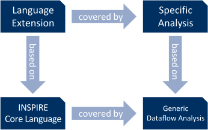

# Framework Implementation

Now, that our stage has been properly decorated with the required background knowledge and a grand overview, we can dive into the actual implementation of the framework.

First we take a look at the build infrastructure and the adapter used for communication between Haskell and C++.
The modelling of the INSieme Parallel Intermediate REpresentation (INSPIRE) in Haskell follows.
The fixpoint solver; together with modelling of arrays, structures, and unions; program points; and memory state is presented next.
The final part investigates the base analyses required and provided by the framework.

## Build Process

First, we examine the build process.
Remember that the Adapter module exists in both, the Haskell and C/C++ domain, as it bridges the gap between them.
Because of this, we do not solely rely on the [Haskell
Stack](https://www.haskellstack.org) build tool but also on [CMake](https://cmake.org), utilised by Insieme.
For Insieme's fully automated build process, CMake invokes Haskell Stack with the required parameters to build the Haskell modules of the toolkit.

### Compiling HAT into a Library

Haskell Stack is not only designed for automating the build process of Haskell packages, but also serves as a package manager to download, build and install third-party packages.
Packages for this mechanism are hosted on [Stackage](https://www.stackage.org) in different versions.
Furthermore Haskell Stack also sets up a suitable compiler for the chosen *release*.
On Stackage a release, like `lts-7.0`, groups together a set of packages, a specific version for each of these packages, and a specific version of the Glasgow Haskell Compiler (GHC).

In our case we are using the release `lts-6.17` which brings `ghc-7.10.3` along.
This release contains almost all packages we need, except [`attoparsec-binary`](https://www.stackage.org/package/attoparsec-binary) and [`directory`](https://www.stackage.org/package/directory).
Fortunately, Haskell Stack allows us to specify these requirements in the corresponding config file (`stack.yaml`) where we also state which release we are using.
When specifying these extra dependencies, we also need to supply a specific version for each of them.
In our case the entries are `attoparsec-binary-0.2` and `directory-1.2.6.3`.

Haskell Stack downloads all required packages and the Haskell compiler into a directory referred to as Stack Root.
By default this is a folder named `.stack` inside the home-directory of the user invoking the Haskell Stack binary `stack`.
This default setting can be overwritten by setting the `STACK_ROOT` environment variable when executing `stack`.
The version of stack we are currently using (`1.0.4`) turned out to be quite picky about the ownership of the directory containing the Stack Root folder.
If the directory belongs to a different user than the one invoking `stack`, it complains -- even though the user has sufficient permissions to create the Stack Root folder.

A pre-compiled binary for Haskell Stack is available for common distributions and allows one to use it without having any Haskell related stuff installed.
The only dependencies are the GMP and zlib libraries, which are widely available for any Linux based platform.

### Linking the Shared Libraries

Stack itself is capable of building a shared library out of a Haskell project.
Typically each third-party package is built as a shared library and so is the Haskell-based Analysis Toolkit (HAT).
The library resulting from HAT, named `libHSinsieme-hat-0.2.so`, depends on the shared libraries of the third-party packages.
Furthermore, neither the shared library of HAT nor any of the other third-parties contain the Haskell runtime environment.
We therefore need to link the shared library `libHSrts-ghc7.10.3.so` containing the runtime explicitly when building Insieme.

During this process we discovered that Stack, at least in the version used, strips symbols, which are required for the linking process, from a shared library.
It is therefore required to patch Haskell Stack, and hence remove this behaviour, since there was no option provided to prevent this from happening.
The patch can be viewed in the following code snippet and shows that the only change needed is to pass the `--disable-library-stripping` flag to the [Cabal](https://www.haskell.org/cabal) library.
The Cabal library is responsible for the compilation process and used by Stack.
Luckily Insieme comes with a dependencies installer capable of building third-party software from source and injecting patches.

```diff
--- a/src/Stack/Types/Build.hs
+++ b/src/Stack/Types/Build.hs
@@ -606,6 +606,7 @@ configureOptsNoDir :: EnvConfig
                    -> [String]
 configureOptsNoDir econfig bco deps wanted isLocal package = concat
     [ depOptions
+    , ["--disable-library-stripping"]
     , ["--enable-library-profiling" | boptsLibProfile bopts || boptsExeProfile bopts]
     , ["--enable-executable-profiling" | boptsExeProfile bopts && isLocal]
     , ["--enable-split-objs" | boptsSplitObjs bopts]
```

A different issue, mainly arising from the way CMake operates, is *finding* the resulting shared library.
Files generated during the build process, as well as the output files, are placed inside a folder named `.stack-work` inside the project directory.
In our case the wanted shared library is located at

    .stack-work/dist/x86\_64-linux/Cabal-1.22.5.0/build/libHSinsieme-hat-0.2-7YeplHX5wtl1qxdm3bLxLA-ghc7.10.3.so

Yet, the `.stack-work` directory does not exist prior to the build process and certain meta information is encoded in the path.
Among architecture (`x86_64`), Cabal library version (`1.22.5.0`), and GHC version (`7.10.3`), a so-called [*package key*](https://ghc.haskell.org/trac/ghc/wiki/Commentary/Packages/Concepts) (`7YeplHX5wtl1qxdm3bLxLA`) is present.
This package key is a hash of the package name, package version, and its dependencies.
It is therefore very likely to change during development.
CMake requires one to explicitly state the name of a shared library for linking plus its location, which must be known during the CMake run -- before building the library.
In our case, since the file name is likely to change, a workaround has been put into place.
A script named `copyLibs.hs` is executed by CMake after invoking `stack`, which finds the shared library inside the `.stack-work` directory using a [glob](https://en.wikipedia.org/wiki/Glob_(programming)) and copies it to CMake's build directory of HAT.
Version and package key are stripped resulting in the file name `libHSinsieme-hat.so`.

Now linking this shared library can be stated explicitly in the CMake configuration, but the linker proofs to be to smart for our con.
The original file name (containing version and package key) is present inside the shared library's meta data^[see Executable and Linkable Format (ELF) which is used by the linker].
The linker now complains that it cannot find the file with this name -- so we need another workaround for the workaround.
This is achieved by copying the library to the build directory not only once, but twice.
Once with the version and package key stripped from the file name so we can state it in the CMake configuration and once without anything stripped so the linker finds the correct file.
This is to be found in the following file of the Insieme code base:

<span class="file">code/analysis/src/cba/haskell/insieme-hat/CMakeLists.txt</span>

## Adapter

The Adapter is responsible for attaching HAT to the Insieme compiler.
It therefore consists of Haskell, as well as, C/C++ code.
Through the use of a Foreign Function Interface (FFI) data can be transferred between the two domains.
This works by exporting Haskell and C++ function in such a way that they can be linked and called like regular C functions.
It follows that the names are not mangled and the platform's default C [*calling convention*](https://en.wikipedia.org/wiki/Calling_convention) is used for these functions.

### Foreign Function Interface

Both languages provide a simple mechanism to export functions for FFI.
Two examples, one for C++  and one for Haskell are given.

```{.cpp .numberLines}
#include <iostream>

extern "C" {
	void hello_world(void) {
		std::cout << "Hello World"
		          << std::endl;
	}
}
```

```{.haskell .numberLines}
{-# LANGUAGE ForeignFunctionInterface #-}

foreign export ccall "hello_world"
  helloWorld :: IO ()

helloWorld = putStrLn "Hello World"
```

In C++ the directive `extern "C"` is all that is required to export the function correctly.
In the Haskell domain we first have to declare that we are using the FFI language extension in the first line.
Next, in addition to a regular function definition (line 6) we declare that a function should be exported using C calling convention (`ccall`) and with the symbol `hello_world` in line 3.
The following line (4) belongs to that FFI declaration and states which Haskell function is to be exported, including the type signature of that function.
Note that all functions exported via the FFI live in the `IO` monad.

That alone is quite nice, but not very useful.
We also require to *import* a function exposed via the FFI.
The following code does exactly that.

```{.cpp .numberLines}
extern "C" {
	void hello_world(void);
}
```

```{.haskell .numberLines}
{-# LANGUAGE ForeignFunctionInterface #-}

foreign import ccall "hello_world"
  helloWorld :: IO ()
```

In C++ we just need to wrap the function declaration inside `extern "C"`.
For Haskell instead of `export` we now use `import` followed by stating C calling convention and the name of the symbol to import.
The following line (4) states under which name that function is made available in Haskell and which type signature it has.

While this example does not illustrate data being transferred between the two domains, it shows the basic structure of building an FFI.
Primitives^[integers, doubles, and pointers] can be passed back and forth just like regular function parameters / return values.
Haskell's `Foreign.Ptr` and `Foreign.C.Types` modules contain the relevant types for sending and receiving data over the FFI.
Additionally the module `Foreign.C.String` is dedicated to transferring C strings.

In this context we have two different types of pointers, depending on where the target pointed to is located.
If the pointer refers to an object living in the C++ domain we use the generic type `Ptr a` in Haskell.
When exposing a pointer to a Haskell object^[By *Haskell object* in C++ we actually mean an instantiated Algebraic Data Type (ADT)] we use `StablePtr a`.
The function `newStablePtr :: a -> IO (StablePtr a)` gives us a pointer to a Haskell object and marks the object as *stable*, meaning it will not be moved or deallocated by the garbage collector.
Similar to dynamic memory management, we later have to *un-stable* the object by calling `freeStablePtr`.
Note that the pointers can be passed back and forth between the two domains as needed.
To dereference a pointer in Haskell one can either use `deRefStablePtr` or `peek` depending on the type.

Most of the time we do not use `peek` directly.
Since working with arrays and strings is quite common, Haskell serves us some convenience functions like `peekArray` and `withArrayLen` for reading, and `pokeArray` for writing.

Despite the fact that [*marshalling*](https://en.wikipedia.org/wiki/Marshalling_(computer_science)) can be done in Haskell, we do not use it in the framework.
INSPIRE, being the most complex data structure transferred from C++ to Haskell, is exported to its binary format, which is then parsed into a rose tree (see [INSPIRE]).
To pass complex data structures from Haskell to C++, we first recreate the data structure in C++ and export its constructor(s) via FFI.
An example of this is provided in the Arithmetic module (see [Arithmetic Formula]).

### Haskell RunTime System

In order to use Haskell in a C++ project, like Insieme, we not only have to link together all the correct parts and use a correct FFI.
We also have to initiate (and tear down) the Haskell RunTime System (Haskell RTS).
The two functions `hs_init` and `hs_exit` fulfil this functionality, where the initialise function optionally takes arguments which are then passed to the Haskell RTS.
Since GHC does no longer support calling `hs_exit` from a non-static object's destructor, the Haskell RTS is initialised and terminated by a static object.
No arguments are passed to the runtime.

```{.cpp .numberLines}
extern "C" {
	void hs_init(int*, const char**[]);
	void hs_exit(void);
}

class Runtime {
  public:
	Runtime() { hs_init(nullptr, nullptr); }
	~Runtime() { hs_exit(); }
} rt;
```

<span class="file">code/analysis/src/cba/haskell/runtime.cpp</span>

### Context

For easier interaction between the two domains a *context* is established.
This *context* consists of a Haskell object and a C++ object which are linked to each other by pointers.
We will see its benefits when talking about the [IR components].

On the Haskell end, the *context* is used to retain a received INSPIRE program and the solver's state.
Holding on to the solver's state is important to reuse already computed information for new analysis runs.
When using the toolkit without the Insieme compiler, this *context* can still be used by setting the reference to its corresponding C++ object to `nullPtr`.
By allowing for this *dummy context* we do not require an additional interface for the toolkit because it is used without Insieme.

## IR Components

Next, we take a look at the components relevant to model INSPIRE.
The bottom layer is composed of the node types and a rose tree.
Node addresses, visitors and queries build upon this.
An INSPIRE program is converted to its binary representation (using Insieme's binary dumper) and passed to the toolkit via the FFI.
The binary dump's format can be inferred manually from the Insieme source code^[<span class="file">code/core/src/dump/binary_dump.cpp</span>].
Relevant parts are covered in the presentation of the binary parser.

The binary dump, representing an INSPIRE program also comes with a list that states operators used by that program together with a node address pointing to the function describing it.

### Node Types

The full set of node types is defined in the `ir_nodes.def` file of the Insieme core.
It is processed via the use of the C pre-processor to construct an enum holding all node types, which is then used by Insieme.
Luckily we also have the option to process such a file in Haskell using [`c2hs`](https://github.com/haskell/c2hs).
With this tool, we can get a full list of available node types in exactly the same order as the Insieme core does.
Maintaining the order is important since the binary dump simply uses the index in this enum for communicating the node type.
Yet we do not use this enum directly.
What we seek is something like this:

```{.haskell .numberLines}
data NodeType = BoolValue   Bool
              | CharValue   Char
              | IntValue    Int
              | UIntValue   Int
              | StringValue String
              | CompoundStmt
              | IfStmt
              | WhileStmt
              | CompoundStmt
--            | ...
```

This data structure is a list of *all* possible node types, where the *value nodes* have their value already attached.
With this approach we run into two problems.
First, we cannot derive this exact type definition from `ir_nodes.def` using `c2hs`.
Second, we cannot let the compiler derive an `enum` instance for this data structure.
To circumvent these two problems we have to resort to Template Haskell (TH).
TH offers a way to modify the Haskell syntax tree prior to compilation -- it is basically a pre-process.

First the `ir_nodes.def` file gets included filling a C enum that is then converted to Haskell using `c2hs`.
All entries of this enum are prefixed with `NT_`.
Based on this enum TH is used to define a data structure `NodeType` similar to the enum and two functions `fromNodeType` and `toNodeType`.
`NodeType` is composed of all node types (without the `NT_` prefix) and value nodes have their corresponding value attached to them.
This is exactly the data structure we want.

<span class="file">code/analysis/src/cba/haskell/insieme-hat/src/Insieme/Inspire/NodeType.chs</span>

### Node Path

```haskell
type NodePath = [Int]
```

A *node path* is a list of child indices describing a path along the tree starting at some node.
It is commonly used to reference a node in INSPIRE.
Each index tells you which child to go to next.
You have reached the target upon depleting the list.

<span class="file">code/analysis/src/cba/haskell/insieme-hat/src/Insieme/Inspire/NodeAddress.hs</span>

### Binary Parser

The binary parser of the Inspire module builds upon [`Attoparsec`](https://hackage.haskell.org/package/attoparsec), which is a library for constructing combinator parsers.
Together with the [`attoparsec-binary`](https://hackage.haskell.org/package/attoparsec-binary) package it becomes quite easy to build a binary parser for the INSPIRE export.
The binary dump is mainly composed of three differently sized integer types and strings.
We therefore define ourselves the following parser combinators.

```{.haskell .numberLines}
anyInt8 :: Parser Int
anyInt8 = fromIntegral <$> anyWord8

anyInt16 :: Parser Int
anyInt16 = fromIntegral <$> anyWord16le

anyInt32 :: Parser Int
anyInt32 = fromIntegral <$> anyWord32le

parseString :: Parser String
parseString = liftM BS8.unpack $ take =<< anyInt32
```

Integers larger than one byte are dumped in [little endian](https://en.wikipedia.org/wiki/Endianness), while strings are always prefixed with their length and do not contain a terminator.

The header of the binary dump starts with the magic number `0x494e5350495245` and a list of *converters*.
Like strings, lists are prefixed with the number of elements.
Converters are only relevant when using annotations attached to the INSPIRE program and since we do not use them, they are discarded by the main parser.
The header is parsed with this set of combinators.

```{.haskell .numberLines}
parseHeader :: Parser [String]
parseHeader = parseMagicNr *> parseConverters

parseMagicNr :: Parser Word64
parseMagicNr =  word64le 0x494e5350495245
            <|> fail "wrong magic number"

parseConverter :: Parser String
parseConverter = parseString

parseConverters :: Parser [String]
parseConverters = do
    n <- anyInt32
    count n parseConverter
```

The main part of the binary dump -- the encoding of the IR nodes -- is a list of nodes, where each node starts with an integer encoding its type.
If the node is a value node, the value follows, otherwise a list of integers follows telling us the node's children.
The integers are list indices referring to other nodes in the same list.
Each node can be followed by a list of annotations which is discarded by our parser.
We first parse the whole list of nodes from the dump to create an integer map of, so called, `DumpNode`s, where the key is the corresponding index in the list.
`DumpNode` is a node where child nodes are referenced through indices, instead of actual nodes.
The following code parses a single `DumpNode`.

```{.haskell .numberLines}
data DumpNode = DumpNode IR.NodeType [Int]

parseDumpNode :: Parser DumpNode
parseDumpNode = do
    -- get node type
    t <- toEnum <$> anyInt16

    -- create corresponding node
    n <- case t of
        -- value nodes
        IR.NT_BoolValue   -> DumpNode <$> IR.BoolValue <$> (/=0) <$> anyInt8     <*> pure []
        IR.NT_CharValue   -> DumpNode <$> IR.CharValue <$> chr   <$> anyInt8     <*> pure []
        IR.NT_IntValue    -> DumpNode <$> IR.IntValue            <$> anyInt32    <*> pure []
        IR.NT_UIntValue   -> DumpNode <$> IR.UIntValue           <$> anyInt32    <*> pure []
        IR.NT_StringValue -> DumpNode <$> IR.StringValue         <$> parseString <*> pure []

        -- other nodes
        _              -> do
            c  <- anyInt32
            is <- count c anyInt32
            return $ DumpNode (IR.fromNodeType t) (fromIntegral <$> is)

    -- skip annotations
    a <- anyInt32
    count a anyWord64le

    return $ n
```

After this phase is completed, the `DumpNode`s are gradually converted into a single rose tree.
The first node, the one with index zero, marks the root of the tree.
Nodes may be referenced by the indices multiple times, yet it is important to construct a node only once and reuse already constructed ones.
Otherwise we end up with multiple instances of the same node in memory, wasting not only a big amount of space, but also a lot of time when checking for equality later on.
This concept is referred to as *node sharing* and, while Haskell does not offer us a way to handle references explicitly, we can deal with them by carefully using the constructor and already defined nodes.
Each constructed node is temporarily stored using the `State` monad and a map during the construction of the rose tree.

```{.haskell .numberLines}
connectDumpNodes :: IntMap.IntMap DumpNode -> IR.Tree
connectDumpNodes dumpNodes = evalState (go 0) IntMap.empty
  where
    go :: Int -> State (IntMap.IntMap IR.Tree) IR.Tree
    go index = do
        memo <- get
        case IntMap.lookup index memo of
            Just n  -> return n
            Nothing -> do
                let (DumpNode irnode is) = dumpNodes IntMap.! index
                children <- mapM go is
                let n = IR.mkNode index irnode children []
                modify (IntMap.insert index n)
                return n
```

Now that we have the rose tree representing the received INSPIRE program we still need to do one slight modification.
We go over each node one more time and attach information about operators (ie language extensions).
This step is done by the function `markBuiltins` in line 15 (next code snippet).
As already mentioned, after the binary dump of the INSPIRE program, a list of node paths addressing operators is provided by the binary dump.

We now have all the parts to construct the complete binary parser.
The function `parseBinaryDump` combines what we have established in this section.
It takes the whole binary dump as input and returns either the constructed rose tree or an error message.

```{.haskell .numberLines}
parseBinaryDump :: BS.ByteString -> Either String IR.Tree
parseBinaryDump = parseOnly $ do
    -- parse components
    parseHeader
    n            <- anyInt32
    dumpNodes    <- IntMap.fromList <$> zip [0..] <$> count n parseDumpNode
    m            <- anyInt32
    dumpBuiltins <- Map.fromList <$> count m parseBuiltin
    l            <- anyInt32
    paths        <- count l parseNodePath

    -- connect components
    let root     = connectDumpNodes dumpNodes
    let builtins = resolve root <$> dumpBuiltins
    let ir       = markBuiltins root builtins

    return ir

  where
      resolve :: IR.Tree -> [Int] -> IR.Tree
      resolve node []     = node
      resolve node (x:xs) = resolve (IR.getChildren node !! x) xs
```

<span class="file">code/analysis/src/cba/haskell/insieme-hat/src/Insieme/Inspire/BinaryParser.hs</span>

Let us now take a final look at the adapter to see how this parser is used.

```{.haskell .numberLines}
foreign export ccall "hat_initialize_context"
  initializeContext :: Ctx.CContext -> CString -> CSize -> IO (StablePtr Ctx.Context)

initializeContext context_c dump_c size_c = do
    dump <- BS8.packCStringLen (dump_c, fromIntegral size_c)
    let Right ir = BinPar.parseBinaryDump dump
    newStablePtr $ Ctx.mkContext context_c ir

```

Upon setting up a context, the Haskell side receives a reference to the corresponding C++ object (`Ctx.CContext`) and the binary dump in form of a byte array (plus its length).
This array is *packed* -- necessary so the parser can work with it -- and then parsed.
The result is our rose tree.
This allows us to setup an analysis context in Haskell.

<span class="file">code/analysis/src/cba/haskell/insieme-hat/src/Insieme/Adapter.hs</span>

### Visitors

Since we have defined our own tree structure for INSPIRE we also have to provide some basic visitor functionality.
For performance critical reasons one can stop the visiting process at a controlled depth.
This is referred to as *pruning*.
The following visitors are provided.

`foldTree`
  ~ Folds the whole tree.
    No pruning takes place.
    `fold` is the Haskell equivalent of a reduction.

`foldTreePrune`
  ~ Same as `foldTree`, but allows you to prune at any point.

`foldAddress`
  ~ Folds the subtree starting at a given address.
    No pruning takes place.

`foldAddressPrune`
  ~ Same as `foldAddress`, but allows you to prune at any point.

`collectAll`
  ~ Returns a list of node addresses to all nodes satisfying a given predicate of the `NodeType`.
    No pruning takes place.

`collectAllPrune`
  ~ Same as `collectAll`, but allows you to prune at any point.

`foldTree` and `foldTreePrune` operate on nodes while `foldAddress` and `foldAddressPrune` operate on node addresses.

<span class="file">code/analysis/src/cba/haskell/insieme-hat/src/Insieme/Inspire/Visit.hs</span>

### Node References and Queries

To facilitate using the tree IR structure and node addresses a list of useful queries are implemented.
These include, for example, checking if the given node is an operator or getting its type.
The type-class `NodeReference` has been defined in order to allow nodes of the tree and node addresses to use the same queries, hence both of them implement this type class.
The list of queries can be extended later on.
Note that there exist a few^[Currently `isLoopIterator`, `hasEnclosingStatement`, `isEntryPoint`, and `isEntryPointParameter`.] queries which can only be used with node addresses.
This is due to the fact that a node address allows you to look at the parent of the referred node, which is not possible by using only plain nodes.

Furthermore a function `findDecl` is provided, which takes a node address pointing to a variable and tries to find its declaration.

<span class="file">code/analysis/src/cba/haskell/insieme-hat/src/Insieme/Inspire/Query.hs</span>

### Context

Up until now we have already heard that a context is established in both domains and keeps track of the solver's state.
We now take a look at the context's definition in C++ and how it is setup and used.
The important parts are displayed below.

```{.cpp .numberLines}
typedef void* StablePtr;
typedef void* HaskellNodeAddress;

class Context {

	StablePtr context_hs;

	core::NodePtr root;

	std::map<core::NodeAddress, HaskellNodeAddress> addresses;

  public:

	Context();
	explicit Context(const core::NodePtr& root);
	~Context();

	// move semantics
	Context(const Context& other) = delete;
	Context(Context&& other) = default;

	Context& operator=(const Context& other) = delete;
	Context& operator=(Context&& other) = default;

	// -- haskell engine specific requirements --

	StablePtr getHaskellContext() const;
	void setHaskellContext(StablePtr);

	void setRoot(const core::NodePtr&);
	core::NodePtr getRoot() const;

	HaskellNodeAddress resolveNodeAddress(const core::NodeAddress& addr);
	core::NodeAddress resolveNodeAddress(const HaskellNodeAddress& addr);

};
```

The context holds a stable pointer to its counter part in the Haskell domain and a specific INSPIRE program is associated with it.
Furthermore it caches already transferred node addresses.
Since the context in C++ is responsible for freeing (ie *un-stabling* Haskell objects) it has a custom destructor and no copy semantics.
Node addresses can be resolved in both directions using `resolveNodeAddress`.
To use it, just create an instance of the class, passing the root of an INSPIRE program to the constructor.
Functions initiating an analysis take the context as their first argument, which is then used to convert IR information.
This allows us to isolate the FFI code from the rest of Insieme.
Two function declarations, providing the user-interface to HAT-based analyses, are given as examples.
Their signatures do not contain any Haskell related parts.

```{.cpp .numberLines}
bool mayBeTrue(Context& ctxt, const ExpressionAddress& expr);

ArithmeticSet getArithmeticValue(Context& ctxt, const ExpressionAddress& expr);
```

First the context needs to be established as described.
Afterwards both functions can be used directly.
What exactly these two functions do is covered later in the [Base Analyses].

<span class="file">code/analysis/include/insieme/analysis/cba/haskell/context.h</span>

## Utilities

Before continuing with investigating the actual framework we take a look at some utilities used by the framework.
The two most notable are bound sets and arithmetic formulas.

### Bound Sets

A *bound set* is similar to a regular set, apart from the fact that it is associated with an upper bound.
When the number of elements within the set exceeds this upper bound, the set turns into *universe* representing every possible value of the domain.
Of course, using this set as property spaces for program analyses likely yields over approximations as soon as the set turns into *universe*.
Yet it is necessary to maintain termination of the analyses (thus decidability).
Note that the bound can be adjusted even during an analysis run to maximise flexibility, but adjusting it changes the type of the bound set.
Its definition:

```haskell
data BoundSet bb a = BoundSet (Data.Set.Set a) | Universe
```

The functions provided are quite similar to the ones from `Data.Set`, as can be seen by the export list.

```{.haskell .numberLines}
module Insieme.Utils.BoundSet (
    BoundSet(Universe),
    empty, singleton,
    size, null, isUniverse, member,
    fromSet, fromList, toSet, toList,
    insert, applyOrDefault, filter, map, lift2,
    union, intersection, cartProduct,
    -- ...
) where
```

Bounds are defined in the following way.

```{.haskell .numberLines}
class Typeable b => IsBound b where
    bound :: p b a -> Int

getBound :: IsBound bb => BoundSet bb a -> Int
getBound bs = bound bs

changeBound :: (IsBound bb, IsBound bb', Ord a)
            => BoundSet bb a -> BoundSet bb' a
changeBound  Universe    = Universe
changeBound (BoundSet s) = fromSet s

data Bound10 = Bound10
instance IsBound Bound10 where
    bound _ = 10

data Bound100 = Bound100
instance IsBound Bound100 where
    bound _ = 100
```

The type-class requires the implementation of `bound` which takes a *bounded object* as input and returns the *capacity* associated with this bound.
Two bounds, `Bound10` and `Bound100`, are already defined.
More bounds can be added as needed.
Having the bound encoded into the type of the bounded container prevents accidental combining of differently bound containers.
A function `changeBound` can be used to explicitly convert between them.

Although we took `Data.Set` as a reference, bound sets are not interoperable with it.
Yet, sometimes an *unbound* set is required (or helpful) and it would be convenient to use the same interface.
We therefore define ourselves the `Unbound` bound.

```{.haskell .numberLines}
data Unbound = Unbound

instance IsBound Unbound where
    bound _ = -1

type UnboundSet a = BoundSet Unbound a

toUnboundSet :: (IsBound bb, Ord a) => BoundSet bb a -> UnboundSet a
toUnboundSet = changeBound
```

Some analyses yield a result in the form of a bound set (eg arithmetic value).
Therefore a similar data structure exists at the C++ side.
With it, results wrapped in a bound set can be transferred across the two domains as long as the element type is transferable.

Along with this, convenience functions are provided, among them `map`, `lift2`, `cartProduct`, and `applyOrDefault`.

<span class="file">code/analysis/src/cba/haskell/insieme-hat/src/Insieme/Utils/BoundSet.hs</span>

### Arithmetic Formulas

The purpose of the Arithmetic module is to model arithmetic formulas.
For now only basic integer operations are implemented.
On both sides -- C++ and Haskell -- a data structure is defined to model these formulas.
Here is the definition of the Haskell part.

```{.haskell .numberLines}
-- v...variable type
-- c...constant type

-- Something like $x^2$.
data Factor c v  = Factor  { base     :: v
                           , exponent :: c }

-- Something like $x^2 y^2$.
data Product c v = Product { factors  :: [Factor c v] }

-- Somethign like $-2 x^2 y^3$.
data Term c v    = Term    { coeff    :: c
                           , product  :: Product c v }

-- Something like $-2 x^2 y^3 + 5 z^3 + 2$.
data Formula c v = Formula { terms    :: [Term c v] }
```

The types of variables `v` and coefficient / exponent `c` are generic.
Node addresses are commonly used as variables to reference a variable (or expression) in the INSPIRE program.
Using integer types from `Foreign.C.Types` instead of `Integer` allows more accurate modelling of overflow behaviour.

Two formulas can be added, subtracted and multiplied.
Division by a constant is supported, but may only be accurate if the remainder is zero.
For now this model seemed adequate, but can be replaced in the future by one more accurate.

In addition to the representation of arithmetic formulas, we bring a different definition of *numeric ordering* along.

```{.haskell .numberLines}
data NumOrdering = NumLT | NumEQ | NumGT | Sometimes

class NumOrd a where
    numCompare :: a -> a -> NumOrdering

fromOrdering :: Ordering -> NumOrdering
fromOrdering LT = NumLT
fromOrdering EQ = NumEQ
fromOrdering GT = NumGT
```

A formula can either always be greater than, less than, or equal to another formula; or the ordering depends on the value of variables (`Sometimes`).
These four different outcomes are modelled here.

For transferring an arithmetic formula from Haskell to C++ we have to reconstruct the formula part by part.
For this purpose the corresponding constructors are wrapped and made available to the Adapter via the FFI as seen below.

```{.haskell .numberLines}
foreign import ccall "hat_mk_arithmetic_formula"
  arithmeticFormula :: Ptr (Ptr CArithmeticTerm) -> CSize -> IO (Ptr CArithmeticFormula)

foreign import ccall "hat_mk_arithmetic_product"
  arithmeticProduct :: Ptr (Ptr CArithmeticFactor) -> CSize -> IO (Ptr CArithmeticProduct)

foreign import ccall "hat_mk_arithmetic_term"
  arithmeticTerm :: Ptr CArithmeticProduct -> CULong -> IO (Ptr CArithmeticTerm)

foreign import ccall "hat_mk_arithemtic_factor"
  arithemticFactor :: Ptr CArithmeticValue -> CInt -> IO (Ptr CArithmeticFactor)

foreign import ccall "hat_mk_arithmetic_value"
  arithmeticValue :: Ctx.CContext -> Ptr CSize -> CSize -> IO (Ptr CArithmeticValue)
```

The following function does all the heavy lifting on the Haskell side.

```{.haskell .numberLines}
passFormula :: Integral c
            => Ctx.CContext
            -> Ar.Formula c Addr.NodeAddress
            -> IO (Ptr CArithmeticFormula)

passFormula ctx_c formula_hs = do
    terms_c <- forM (Ar.terms formula_hs) passTerm
    withArrayLen' terms_c arithmeticFormula
  where
    passTerm :: Integral c => Ar.Term c Addr.NodeAddress -> IO (Ptr CArithmeticTerm)
    passTerm term_hs = do
        product_c <- passProduct (Ar.product term_hs)
        arithmeticTerm product_c (fromIntegral $ Ar.coeff term_hs)

    passProduct :: Integral c => Ar.Product c Addr.NodeAddress -> IO (Ptr CArithmeticProduct)
    passProduct product_hs = do
        factors_c <- forM (Ar.factors product_hs) passFactor
        withArrayLen' factors_c arithmeticProduct

    passFactor :: Integral c => Ar.Factor c Addr.NodeAddress -> IO (Ptr CArithmeticFactor)
    passFactor factor_hs = do
        value_c <- passValue (Ar.base factor_hs)
        arithemticFactor value_c (fromIntegral $ Ar.exponent factor_hs)

    passValue :: Addr.NodeAddress -> IO (Ptr CArithmeticValue)
    passValue addr_hs = withArrayLen' (fromIntegral <$> Addr.getAbsolutePath addr_hs)
                                      (arithmeticValue ctx_c)

    withArrayLen' :: Storable a => [a] -> (Ptr a -> CSize -> IO b) -> IO b
    withArrayLen' xs f = withArrayLen xs (\s a -> f a (fromIntegral s))
```

The formula is reconstructed from the bottom up, where `value` here refers to node addresses and are the variables of the formula.

<span class="file">code/analysis/src/cba/haskell/insieme-hat/src/Insieme/Utils/Arithmetic.hs</span>

## Fixpoint Solver

This section describes the solver itself together with the `Lattice` type-class and used data structures for `Variable`s, `Assignment`s, and `Constraint`s.

### Lattice

For implementation, two different names for the (complete) lattice and join-semi-lattice are used -- `ExtLattice` and `Lattice` respectively.

```{.haskell .numberLines}
class (Eq v, Show v, Typeable v, NFData v) => Lattice v where
    join :: [v] -> v
    join [] = bot
    join xs = foldr1 merge xs

    merge :: v -> v -> v
    merge a b = join [a,b]

    bot :: v
    bot = join []

    less :: v -> v -> Bool
    less a b = (a `merge` b) == b

class (Lattice v) => ExtLattice v where
    top :: v
```

`join` describes how a list of values is combined into a single one.
`merge` is just the binary version of `join` as can be seen by the default implementation.
`less` determines whether one element of the lattice is less^[$a < b \Longleftrightarrow a\ \text{is a more accurate value for an analyses than}\ b$] than another element.
This type-class must be instantiated by the property space of each analyses.

### Variables

Analysis variables are described briefly in [Analysis Variables].
An analysis variable is associated with a list of constraints restricting potential `Assignment`s and a unique identifier.
The definition follows.

```{.haskell .numberLines}
data Identifier = Identifier { analysis :: AnalysisIdentifier
                             , idValue  :: IdentifierValue
                             , idHash   :: Int }

data AnalysisIdentifier = AnalysisIdentifier { aidToken :: TypeRep
                                             , aidName  :: String
                                             , aidHash  :: Int }

data IdentifierValue = IDV_Expression NodeAddress
                     | IDV_ProgramPoint ProgramPoint
                     | IDV_MemoryStatePoint MemoryStatePoint
                     | IDV_Other BS.ByteString
  deriving (Eq,Ord,Show)


data Var = Var { index :: Identifier
               , constraints :: [Constraint]
               , bottom :: Dynamic
               , valuePrint :: Assignment -> String }

instance Eq Var where
        (==) a b = (index a) == (index b)

instance Ord Var where
        compare a b = compare (index a) (index b)


newtype TypedVar a = TypedVar Var
        deriving (Show,Eq,Ord)

mkVariable :: (Lattice a) => Identifier -> [Constraint] -> a -> TypedVar a
```

Note that most of the complexity of these definitions comes from the necessary performance optimisations -- in particular for `Variable` comparison.

The identifier used for analysis variables contains an identifier for the corresponding type of analysis (`AnalysisIdentifier`) and a *value* (`NodeAddress`, `ProgramPoint`, `MemoryStatePoint`, or byte string) followed by a hash.
The `Identifier`'s hash is used to speed up equality checks and takes the hash of `AnalysisIdentifier` into account.

The bottom value of an analysis variable depends on the analysis' property space.
We therefore use `Dynamic` as type.
We could use a generic type variable for this, but this would make it difficult to directly work with and combine variables of different analyses.
See the related Haskell Wiki page for more information about using heterogeneous [collections](https://wiki.haskell.org/Heterogenous_collections).

The structure `TypedVar` is used to statically connect a variable with its related property space -- where possible.
This is used in the `Assignment`.
A `Var` is created and wrapped by `mkVariable` given an `Identifier`, a list of `Constraints`, and the bottom value of the corresponding property space.
Only `TypedVar`s may be created.

### Assignments

An `Assignment` is defined as a mapping from analysis variables to
values of the related property space. The interface definition is given below.

```{.haskell .numberLines}
newtype Assignment = Assignment -- ...

get :: (Typeable a) => Assignment -> TypedVar a -> a

set :: (Typeable a, NFData a) => Assignment -> TypedVar a -> a -> Assignment
```

`get` returns the value associated to the given `TypedVar` in the `Assignment`.
The use of `TypedVar` allows us to return the correct type of the value.
`set` modifies an `Assignment` by associating a given `TypedVar` with the given value.

### Constraints

```{.haskell .numberLines}
data Event = None
           | Increment
           | Reset

data Constraint = Constraint
    { dependingOn        :: Assignment -> [Var]
    , update             :: (Assignment -> (Assignment,Event))
    , updateWithoutReset :: (Assignment -> (Assignment,Event))
    , target             :: Var }
```

A `Constraint` is always associated with the one variable which's value it is constraining, here referred to as `target`.
Depending on an `Assignment` a list of variables can be deduced on which the `Constraint` depends on.

A `Constraint` provides us with the two functions `update` and `updateWithoutReset` which mutate a given `Assignment`.
The `update` function also gives us information about what happened in the form of an `Event`.
The three possible outcomes are.

`None`
  ~ The `Assignment` did not change, we can continue without any additional work.

`Increment`
  ~ The `Assignment` changed during the update monotonously, all depending variables need to be reconsidered.

`Reset`
  ~ The current `Assignment` changed in a non-monotonous way, hence a *local restart* needs to be triggered.

The function `updateWithoutReset` is used to prevent local restarts from triggering each other by forcing monotonous updates.
How exactly these three events are handled can be seen in [Solver].

#### Dependencies between Variables

It is essential that the dependencies between variables is correctly established for all analyses.
The framework's functions expect this to be done correctly be the analysis designer.
This means that for a given `Assignment`, all analysis variables used to calculate the value of the current analysis variable must be present in the dependency list of the current variable.
The correct use is illustrated in the following code snippet, given two analysis variables $var_1$ and $var_2$, and an `Identifier` for the new analysis variable (lines 1--3).

```{.haskell .numberLines}
var1  :: Solver.TypedVar Int
var2  :: Solver.TypedVar Int
varId :: Identifier

con :: Constraint
con = createConstraint dep val var

var :: Solver.TypedVar Int
var = mkVariable varId [con] Solver.bot

dep :: Assignment -> [Var]
dep _ = [Solver.toVar var1, Solver.toVar var2]

val :: Assignment -> Int
val a = Solver.get a var1 + Solver.get a var2
```

In lines 6 and 9, a constraint and analysis variable are generated.
Since the value (`val`) of the constraint depends on the values yielded by $var_1$ and $var_2$, the new analysis variable $var$ depends on $var_1$ and $var_2$.
This is stated in lines 6 and 12 where `dep` contains all analysis variable $var$ is depending on, which is used to create the constraint.

### Solver

Before talking about the solving process itself, we model the state of the solver.
`SolverState`, as seen below, captures the current `Assignment` and all processed analysis variables (and thus their constraints) using the already introduced `VariableIndex` structure (see [Variables]).

```haskell
SolverState = SolverState { assignment    :: Assignment
                          , variableIndex :: VariableIndex }
```

The `solve` function takes an initial `SolverState` and a list of desired analysis variables as input, yielding a new `SolverState` containing the modified `Assignment`, containing the least fixpoint solution for the passed analysis variables.

```haskell
    solve :: SolverState -> [Var] -> SolverState
```

Behind the scene `solve` calls `solveStep` which contains the main solver logic.

```haskell
solveStep :: SolverState -> Dependencies -> [IndexedVar] -> SolverState
```

`solveStep` takes as input a `SolverState`, the `Dependencies` between variables and a *worklist* in form of a list of `IndexedVar`.
The result is a new `SolverState`.
The function takes one `IndexedVar` after another from the worklist (third parameter) and processes the constraints associated with this variable.

To process a constraint, the `update` function of this constraint is called with the current assignment, yielding a new assignment and an `Event` (see [Constraints]).
In case the `Event` is `None`, the processing simply continues since the `Assignment` did not change.
If it is `Increment` the constraints depending on the target variable of the current constraint need to be re-evaluated and the related variables are therefore added to the worklist.
The old `Assignment` has been updated by the constraint's `update`.
On `Reset` the function behaves similarly as on `Increment`, however the transitive closure of all dependent variables is reset to their respective bottom values -- unless the current target value is indirectly depending on itself.

At each step, newly generated analysis variables are added to the worklist whenever encountered.
The `VariableIndex`, as well as the `Dependencies`, are updated accordingly.

<span class="file">code/analysis/src/cba/haskell/insieme-hat/src/Insieme/Analysis/Solver.hs</span>

## Modelling Arrays, Structs, and Unions

This section describes how arrays, structs, and unions are modelled in the current state of the framework.
This is a bit tricky since in C/C++ (and thus in INSPIRE) all three structures can be combined with each other, multiple times.
For example having an array of structs or a struct embedded in a struct embedded in a union, and so on.

The two main building blocks we need are `DataPath` and `FieldIndex`.
A `FieldIndex` is used to reference a field in case of a struct or union, or an element (index) in case of an array.
`DataPath` allows us to reference elements of multi-level structures using a list of `FieldIndex`.
Both of these building blocks are implemented in a generic way to be easily extensible in the future.
Thus `FieldIndex` is a type-class for which `SimpleFieldIndex` is our main implementation.

```{.haskell .numberLines}
class (Eq v, Ord v, Show v, Typeable v, NFData v) => FieldIndex v where
    -- ...

data SimpleFieldIndex = Field String
                      | Index Int
                      | UnknownIndex

data Symbol = Constant NodeAddress
            | Variable NodeAddress

instance FieldIndex SimpleFieldIndex where
-- ...

type SymbolicFormula = Ar.Formula CInt Symbol
```

The data structure `Symbol` is used together with `CInt` to specialise the generic arithmetic formula data structure (see [Arithmetic Analysis]).
The result, `SymbolicFormula`, is used when acessing an element of an array.

```{.haskell .numberLines}
data DataPath i = Root
                | Narrow [i]
                | Expand [i]
                | Invalid
```

`DataPath` is used to access the underlying structure of *structured* memory locations, where `Root` refers to the whole structure and `Narrow` to a path starting at the root pointing to a specific sub-structure.
`Expand` is the inverse to `Narrow` and is used to navigate from a sub-structure to an enclosing structure [@herbert_phd, pp. 133--134].

We now combine these building blocks with the `ComposedValue` type-class.

```{.haskell .numberLines}
-- c...composed value type, for modelling the value of composed bojects
--     like arrays, structs, ...
-- i...field index type
-- v...leaf value type to be covered

class (Solver.ExtLattice c, FieldIndex i, Solver.ExtLattice v)
    => ComposedValue c i v | c -> i v where

toComposed :: v -> c
toValue    :: c -> v

setElement :: DataPath i -> c -> c -> c
getElement :: DataPath i -> c -> c

composeElements :: [(i,c)] -> c

top :: c
```

Note the functional [dependency](https://wiki.haskell.org/Functional_dependencies) `c -> i v` stating that `i` and `v` are uniquely determined by `c`.
Take a look at [@jones2000type] for more information on the topic of functional dependencies.
An instance is provided for our use in the framework.

```{.haskell .numberLines}
data ValueTree i a = Leaf a
                   | Node (Data.Map.Map i (Tree i a))
                   | Empty
                   | Inconsistent

instance (FieldIndex i, Solver.ExtLattice a) => ComposedValue (Tree i a) i a where
-- ...
```

Each level in this `ValueTree` data structure corresponds to one level in the structured memory.
Let us look at an example.

```c
int a[2][3] = {
	{1, 2, 3},
	{4, 5, 6}
};
```

```haskell
let a = composeElements [
  (Index 0, composeElements [ (Index 0, toComposed 1),
                              (Index 1, toComposed 2),
                              (Index 2, toComposed 3) ]),
  (Index 1, composeElements [ (Index 0, toComposed 4),
                              (Index 1, toComposed 5),
                              (Index 2, toComposed 6) ])]
```

On the left we see the original structure from an input program, on the right the corresponding `ValueTree` instance.
Since we are representing a 2D array, the `ValueTree` instance also has two levels and `Index` is used for field indexing (see definition of the `SimpleFieldIndex` type in [Datapath]).
One more example using a struct follows.

```c
struct vector3 {
    int x;
    int y;
    int z;
};

struct vector3 u = {7, 8, 9};
```

```haskell
let u = composeElements [ (Field "x", toComposed 7),
                          (Field "y", toComposed 8),
                          (Field "z", toComposed 9) ]
```

Since we are using a struct instead of `Index` we use `Field` together with the corresponding field name as string.

<span class="file">code/analysis/src/cba/haskell/insieme-hat/src/Insieme/Analysis/Entities/FieldIndex.hs</span>\
<span class="file">code/analysis/src/cba/haskell/insieme-hat/src/Insieme/Analysis/Framework/PropertySpace/ComposedValue.hs</span>\
<span class="file">code/analysis/src/cba/haskell/insieme-hat/src/Insieme/Analysis/Framework/PropertySpace/ValueTree.hs</span>

## Generic Data-Flow Analysis

The generic DFA is implemented by a combination of data structures, more specific analyses, and by the main function `dataflowValue`.
Some of the data structures and more specific analyses are covered in [Solver].
The remaining analyses are covered afterwards and grouped under [Base Analyses].

To easily manage the more specific analyses the `DataFlowAnalysis` data structure represents a specific instance of a DFA and is composed of the following fields.

```{.haskell .numberLines}
-- a...analysis type
-- v...property space

data DataFlowAnalysis a v = DataFlowAnalysis
    { analysis                   :: a,
    , analysisIdentifier         :: Solver.AnalysisIdentifier,
    , variableGenerator          :: NodeAddress -> Solver.TypedVar v,
    , topValue                   :: v,
    , entryPointParameterHandler :: NodeAddress -> Solver.TypedVar v,
    , initialValueHandler        :: NodeAddress -> v,
    , initValueHandler           :: v }
```

The `analysis` field is equivalent to the `aidToken` field in `AnalysisIdentifier`.
It serves the purpose of distinguishing different analyses by their type.
Yet, we also have to maintain the `AnalysisIdentifier` itself.

The `variableGenerator` is used for hooking the variable / constraint generator of the specific analysis into the generic framework.
It follows the top value of the corresponding property space.
As a safe fallback, the top value is used by the DFA whenever something unsupported is encountered.

The `entryPointParameterHandler` is used for covering parameters of program entry points -- commonly `argc`, `argv`.

`initialValueHandler` and `initValueHandler` specify the respective value for memory locations -- either upon an initialisation or program start.
The `initialValueHandler` is consulted for dynamic memory locations, while `initValueHandler` deals with static memory locations.

While the data constructor `DataFlowAnalysis` is exported, a simplified version is also provided.

```{.haskell .numberLines}
mkDataFlowAnalysis :: (Typeable a, Solver.ExtLattice v)
                   => a
                   -> String
                   -> (NodeAddress -> Solver.TypedVar v)
                   -> DataFlowAnalysis a v
```

In this function the `analysisIdentifier` is populated with an `AnalysisIdentifier` constructed from the given analysis token and string.
The third parameter is used as the variable / constraint generator.
The respective top value can be deduced from the type and is outputted as result by all handlers, thus `entryPointParameterHandler`, `initialValueHandler`, and `initValueHandler` are set to yield the property space's top value.

An instance of `DataFlowAnalysis` can then be used with the main function of generic DFA `dataflowValue`.
Its signature looks as follows.

```{.haskell .numberLines}
dataflowValue :: (ComposedValue.ComposedValue a i v, Typeable d)
              => NodeAddress
              -> DataFlowAnalysis d a
              -> [OperatorHandler a]
              -> Solver.TypedVar a
```

The first argument specifics the node for which a variable, representing the dataflow value, needs to be computed.
Next an instance of `DataFlowAnalysis` is required to indicate the specific nature of the analysis.
A list of `OperatorHandler`s (see [Operator Handler]) follows.
The result is, of course, an analysis variable corresponding to the specific analysis.
Note that `dataflowValue` can be specialised to a variable / constraint provider by fixing the second and third parameter.

{#fig:dataflowvalue_traversal}

@fig:dataflowvalue_traversal illustrates how dataflow values are aggregated for the expression $1 + 2 \times 3$.
As can be seen, the aggregation happens bottom-up.

<span class="file">code/analysis/src/cba/haskell/insieme-hat/src/Insieme/Analysis/Framework/Dataflow.hs</span>

### Operator Handler

Before continuing on, the concept of `OperatorHandler` is presented.
They provide a simple means to hook more specific logic into the generic DFA (or `ProgramPoint` analysis as we will see later).

This is used to interpret the semantics of abstract operators (and optionally derived operators) (see [Extension Mechanism]).
The definition is straight forward and looks like this.

```{.haskell .numberLines}
data OperatorHandler a = OperatorHandler { covers    :: NodeAddress -> Bool,
                                         , dependsOn :: Assignment -> [Var],
                                         , getValue  :: Assignment -> a }
```

`covers` is used by the generic DFA to check whether this operator handler is to be used for the interpretation of a call to a given function symbol / operator.
The other two functions house the logic of the handler itself.

## Program Point

In the next two subsections we focus on the two interconnected concepts of program points and memory state.
Both concepts have their dedicated generic variable / constraint generator which are utilised by the generic DFA.

The definition of program points follows.

```haskell
    data Phase = Pre | Internal | Post

    data ProgramPoint = ProgramPoint NodeAddress Phase
```

A `ProgramPoint` models a specific point in the execution of an INSPIRE program.
For this purpose a `NodeAddress` referencing a specific node is used together with a `Phase`.
The `Phase` describes at which phase of the execution the referenced node is referenced.
It can be either

`Pre`
  ~ before the referred node is processed;

`Internal`
  ~ while the referred node is processed (only relevant for interpreting operators); or

`Post`
  ~ after the referred node is processed.

### Program Point Analysis

The purpose of the program point analysis is to derive properties from a given `ProgramPoint`.
The generic variable / constraint generator function `programPointValue` of this analysis has the following signature.

```{.haskell .numberLines}
programPointValue :: (Solver.ExtLattice a)
                  => ProgramPoint
                  -> (ProgramPoint -> Solver.Identifier)
                  -> (ProgramPoint -> Solver.TypedVar a)
                  -> [OperatorHandler a]
                  -> Solver.TypedVar a
```

The result is a variable representing the requested information, for which the given `ProgramPoint` (first argument) represents a state value.
The second argument is simply a variable id generator used to generate (unique) identifiers for analysis variables.
The third argument is the analysis for which `programPointValue` is the base.
The list of `OperatorHandler`s is used to intercept and interpret certain operators.

`programPointValue` utilises the predecessor analysis (covered in [Predecessor Analysis]).
The following code example and figure illustrate how the INSPIRE tree is traversed by `programPointValue`.

    // pseudo code
    {
        a = 6;
        b = 7;
        f(a, b);
    }

{#fig:programpoint_traversal}

Each node in @fig:programpoint_traversal has two grey bullets, one to its left, the other to its right.
They represent the `ProgramPoint`'s `Phase`s, `Pre` or `Post` respectively.
These points are traversed in backward direction by the program point analysis -- thus in reverse execution order.
This concept is the basic building block for modelling the backwards analyses in the analysis framework.

Like the data-flow function, this is a generic base for analyses -- not an analysis itself.

#### Data-Flow vs Program Point

The purpose of a data-flow analysis is to determine the value(s) a given expression may exhibit.
In contrast to this, a program point analysis determines the state(s) of some (shared) structure at some point of program execution.

## Memory State

A memory location is defined by a `NodeAddress` referencing its creation point.
Furthermore, we can combine `MemoryLocation` with `ProgramPoint` to define ourselves `MemoryStatePoint`.
A `MemoryStatePoint` references the state of a memory location at a given `ProgramPoint`.

```haskell
data MemoryLocation = MemoryLocation NodeAddress

data MemoryStatePoint = MemoryStatePoint ProgramPoint MemoryLocation
```

In order to find the state of a `MemoryLocation` at a given `ProgramPoint`, a reaching definitions analysis has to be conducted.

### Reaching Definitions Analysis

A reaching definitions analysis is capable of identifying all definitions of a given memory location reaching the `ProgramPoint` of interest.
We therefore now look at the definition of the reaching definitions analysis' property space.

```{.haskell .numberLines}
data Definition = Initial
                | Creation
                | Declaration NodeAddress
                | MaterializingCall NodeAddress
                | Assignment NodeAddress
                | Initialization NodeAddress

type Definitions = BSet.UnboundSet Definition

instance Lattice Definitions where
    bot = BSet.empty
    merge = BSet.union

instance ExtLattice Definitions where
    top = BSet.Universe
```

`Definition` models the different ways a memory location in INSPIRE can be initialised.


`Initial`
  ~ The definition is obtained at program startup.

`Creation`
  ~ The variable is left undefined at its point of allocation.

`Declaration`
  ~ The definition is conducted by an assignment triggered through a *materializing*[^mat]  declaration. The node address refers to that Declaration.

`MaterializingCall`
  ~ The definition is conducted by an assignment triggered through a materializing call.
    The node address refers to that CallExpr.

`Assignment`
  ~ The definition is conducted by an assignment.
    The node address refers to that assignment.

`Initialization`
  ~ The definition is conducted by an initialisation expression. The node address refers to that initialisation.

The signature of `reachingDefinitions` looks as follows:

[^mat]: A temporary (r-value) is written to a memory location so that it can be referenced -- constructor and destructor are managed accordingly -- see the [corresponding CLang documentation](https://clang.llvm.org/doxygen/classclang_1_1MaterializeTemporaryExpr.html#details).

```haskell
reachingDefinitions :: MemoryStatePoint -> Solver.TypedVar Definitions
```

This analysis is used by the memory state analysis.

### Memory State Analysis

Finding the state of a `MemoryLocation` at a given `ProgramPoint` can now be achieved by the memory state analysis, which's variable / constraint generator builds on top of the reaching definitions analysis.

The analysis variable constructed by `reachingDefinitions`, for a given `MemoryState ms`, can be passed to the Solver's `get` function together with an `Assignment` `a` to yield the `Definitions`.

```haskell
reachingDefVar = reachingDefinitions ms
reachingDefVal = Solver.get a reachingDefVar
```

This is almost the information we want. From the \texttt{Definitions} we need
to deduce the actual value the memory location exhibits. This is done by the
following step.

```{.haskell .numberLines}
definingValueVars a = BSet.applyOrDefault [] (concat . (map go) . BSet.toList)
                    $ reachingDefVal a
  where
    go (Declaration       addr) = [variableGenerator analysis $ goDown 1 addr]
    go (MaterializingCall addr) = [variableGenerator analysis $ addr]
    go (Assignment        addr) = [definedValue addr ml analysis]
    go (Initialization    addr) = [definedValue addr ml analysis]
    go _                        = []
```

Here, `definedValue` models the underlying memory structure of the given `MemoryLocation` `ml` using an instance of the `ComposedValue` type-class.
Note that neither for `Initial` nor for `Creation` we can deduce a value more accurate than the worst-case $\top$ element (line 8).

With this last piece in place we can define the memory state analysis' variable / constraint generator function `memoryStateValue`.

```{.haskell .numberLines}
memoryStateValue (MemoryStatePoint _ ml@(MemoryLocation loc)) analysis = var
  where
    var = Solver.mkVariable varId [con] Solver.bot
    con = Solver.createConstraint dep val var

    dep a = (Solver.toVar reachingDefVar) : (
                if BSet.isUniverse defs || BSet.member Creation defs
                then []
                else (map Solver.toVar $ definingValueVars a)
            )
      where
        defs = reachingDefVal a

    val a = case () of
        _ | BSet.isUniverse defs      -> Solver.top
          | BSet.member Initial defs  -> Solver.merge init value
          | otherwise                 -> value
      where
        init = initialValueHandler analysis loc

        value = if BSet.member Creation $ defs
                then ComposedValue.top
                else Solver.join $ map (Solver.get a) (definingValueVars a)

        defs = reachingDefVal a

    varId = -- ..
```

The `initialValueHandler` is used in line 16 if the set of definitions `defs` contains an `Initial`.
The `initialValueHandler`'s result is merged with deduced values.
Constraints (and dependencies) are created accordingly.

## Specific Analyses

Now, after covering the generic DFA, we look at more *specific analyses*.
As already mentioned, these specialised analyses are used by the generic DFA.
While the generic DFA covers the INSPIRE core language, the specific analyses cover individual language extensions.
This relationship is illustrated in @fig:lang_ext_analyses.

As each language extension typically defines a new type and operators, each matching analysis defines an abstract value space for the values of expressions composed by the language extension.
Furthermore, it models the semantics of the associated operators on top of these property spaces.
Thereby we have the cases:

- Operators are abstract literals, hence `OperatorHandler` has to be defined.
- Operators are derived functions, for which their interpretation is implicitly covered by interpreting their definitions -- or an `OperatorHandler` may be defined, if desired.

Another important aspect to note is that the property spaces of analyses are not unique.
There are infinitely many different ones, differing in their correctness, accuracy and evaluation performance.
The designer of an analyses has to chose the right one for a given task.

Also note that not all language extensions are clearly separated.
In Insieme's current state, the *basic language extension* combines some frequently used language constructs like arithmetic and boolean.

{#fig:lang_ext_analyses}

### Identifier Analysis

The purpose of the identifier analysis is to determine the value of expressions representing identifiers.
Thus expressions of type `Identifier` (see [Language Basic]).

This analysis is used by the data path analysis (see [Data Path Analysis]) to track the field names of structs and unions.
Its property space is defined as follows.

```{.haskell .numberLines}
    data Identifier = Identifier String
      deriving (Eq,Ord,Generic,NFData)

    instance Show Identifier where
        show (Identifier s) = s

    type IdentifierSet = BSet.UnboundSet Identifier

    instance Solver.Lattice IdentifierSet where
        bot   = BSet.empty
        merge = BSet.union

    instance Solver.ExtLattice IdentifierSet where
        top   = BSet.Universe
```

The bottom value of the property space represents no identifiers, while the top element represents all identifiers -- hence `BSet.empty` and `BSet.Universe` are used respectively.
When two data-flows merge, the resulting data-flow should contain all identifiers from the two branches, therefore `BSet.union` is used as merge operator.
Also note that the identifier analysis is a *may analysis*.

For the analysis to be usable by the framework, a unique identifier is required.
Together with this identifier we provide the constraint generator function `identifierValue`.

```{.haskell .numberLines}
data IdentifierAnalysis = IdentifierAnalysis
  deriving (Typeable)

identifierValue :: NodeAddress -> Solver.TypedVar (ValueTree SimpleFieldIndex IdentifierSet)
identifierValue addr = case getNode addr of

    IR.Node IR.Literal [_, IR.Node (IR.StringValue x) _] ->
        Solver.mkVariable (idGen addr) [] (compose $ BSet.singleton (Identifier x))

    _ -> dataflowValue addr analysis []

  where
    analysis = mkDataFlowAnalysis IdentifierAnalysis "I" identifierValue
    idGen    = mkVarIdentifier analysis
    compose  = ComposedValue.toComposed
```

In line 13, a `DataFlowAnalysis` is instantiated using the unique identifier, a string `"I"` for easy identification of the associated analysis variables, and `identifierValue`, holding the main logic of the identifier analysis.

The interpretation of most IR constructs is handled by the generic DFA.
We only need to cover the nodes relevant to us.
In our case a Literal, where the second child is a StringValue^[Note that this is an simplification that does not cause harm since *all* literals are covered, where only those of the type 'identifier' would be required.].
An analysis variable is created, using `mkVariable` (line 8) and a newly generated identifier (line 14).
No constraints are associated with the variable and the value associated with the variable is a (bound) set containing the identifier, wrapped up in a `ValueTree`.

One can also see that that no `OperatorHandler`s are used when invoking `dataflowValue` in line 10.
This means that all information derived from Literal nodes is passed along the data-flow without any additional modifications.

#### Connection Between Generic DFA and Specialised Analysis

In line 10 we can see the interaction between the generic DFA and a specialised analysis.
The user would simply invoke `identifierValue` and pass the result to the solver.
If the node targeted is not a Literal, the input program falls back to the generic DFA, which calls our specialised analysis function `identifierValue` for the relevant nodes.
The results are merged according to the `Lattice` instantiation.

<span class="file">code/analysis/src/cba/haskell/insieme-hat/src/Insieme/Analysis/Identifier.hs</span>

### Arithmetic Analysis

[Arithmetic Formulas] has already presented the concept and implementation of arithmetic formulas.
Their main use appears in the arithmetic analysis.
Its task is to derive the arithmetic values a given expression may exhibit.

As mentioned in [Language Mechanism], arithmetic types and operators are defined in the *basic language extension*.
The arithmetic analysis thus covers this part of the *basic language extension*.

The type alias `SymbolicFormula`, previously introduced in [Datapath], is used together with `BoundSet` to compose the arithmetic property space.

```{.haskell .numberLines}
type SymbolicFormulaSet b = BSet.BoundSet b SymbolicFormula

instance BSet.IsBound b => Solver.Lattice (SymbolicFormulaSet b)  where
    bot   = BSet.empty
    merge = BSet.union

instance BSet.IsBound b => Solver.ExtLattice (SymbolicFormulaSet b)  where
    top   = BSet.Universe
```

Similar to the identifiers analysis, the arithmetic analysis is a *may analysis*, therefore `BSet.empty`, `BSet.Universe`, and `BSet.union` are used for $\bot$, $\top$, and the merge operator respectively.


An integer literal in the input program is translated to INSPIRE as a Literal containing a StringValue node.
As the string contained needs to be parsed, a utility `parseInt` is provided.
`parseInt` understands the different C/C++ integer literal formats (eg `0xf`, `072`, `1ul`, `-24`).

```{.haskell .numberLines}
data CInt = CInt32  Int32   -- ^ Represents @int@
          | CInt64  Int64   -- ^ Represents @long@
          | CUInt32 Word32  -- ^ Represents @unsigned int@
          | CUInt64 Word64  -- ^ Represents @unsigned long@
  deriving (Eq,Ord,Generic,NFData)

instance Show     CInt where -- ...
instance Num      CInt where -- ...
instance Enum     CInt where -- ...
instance Real     CInt where -- ...
instance Integral CInt where -- ...

parseInt :: String -> Maybe CInt
```

Before looking at the body of `arithmeticValue` we need to setup the variable / constraint generator implementing the arithmetic analysis, to be used by the solver.

```{.haskell .numberLines}
data ArithmeticAnalysis = ArithmeticAnalysis
  deriving (Typeable)

analysis = (mkDataFlowAnalysis ArithmeticAnalysis "A" arithmeticValue) {

        initialValueHandler = \a -> compose $ BSet.singleton
                                            $ Ar.mkVar
                                            $ Constant (Addr.getNode a) a,

        initValueHandler = compose $ BSet.singleton $ Ar.zero
    }

idGen = mkVarIdentifier analysis
```

The default initial value handler yield the top element of the property space.
For the arithmetic analysis this default is not desired, hence we override it in lines 6--10.
For static memory locations (handled by `initValueHandler`) we can assume the memory location's value to be initialised to 0.
For dynamic memory locations we handle the location as a variable, which enables us to reason about it in more detail than just assuming its content to be $\top$.
For instance, we can deduce that the value of the memory location subtracted from itself yields 0 as result.

Now we are ready to look at `arithmeticValue`.

```{.haskell .numberLines}
arithmeticValue :: Addr.NodeAddress
                -> Solver.TypedVar (ValueTree SimpleFieldIndex
                                              (SymbolicFormulaSet BSet.Bound10))

arithmeticValue addr = case Addr.getNode addr of

    IR.Node IR.Literal [t, IR.Node (IR.StringValue v) _] | isIntType t ->
      case parseInt v of
        Just cint -> Solver.mkVariable (idGen addr) [] (compose $ BSet.singleton
                                                                $ Ar.mkConst cint)

        Nothing   -> Solver.mkVariable (idGen addr) [] (compose $ BSet.singleton
                                                                $ Ar.mkVar c
          where
            c = Constant (Addr.getNode addr) addr)

    IR.Node IR.Variable _ | Addr.isLoopIterator addr ->
        Solver.mkVariable (idGen addr) [] (compose $ BSet.Universe)

    IR.Node IR.Variable (t:_) | isIntType t && isFreeVariable addr ->
        Solver.mkVariable (idGen addr) [] (compose $ BSet.singleton
                                                   $ Ar.mkVar
                                                   $ Variable (Addr.getNode addr) addr)

    IR.Node IR.CastExpr (t:_) | isIntType t -> var
      where
        var = Solver.mkVariable (idGen addr) [con] Solver.bot
        con = Solver.forward (arithmeticValue $ Addr.goDown 1 addr) var

    _ -> dataflowValue addr analysis ops
  where
    -- ...
```

In case the given node address points to a Literal of type integer (line 7), the integer parser utility is consulted (line 8).
If the parse was successful, the result is wrapped in a (constant) arithmetic formula, a (bound) set, and a `ValueTree` (lines 9 and 10).
Otherwise the given node is handled as a mathematical constant and wrapped similarly (lines 12--15).

If we encounter a variable, which is a loop-iterator (line 17), we immediately return `Universe` as the range is commonly to big to consider all possible values in the analysis.
Free variables of type integer are handled explicitly by `arithmeticValue` (line 20).
Such an explicitly handled variable is wrapped in an arithmetic formula, a (bound) set, and a `ValueTree`.
Other variables are covered by the default dataflow analysis.

A CastExpr of (target) type integer simply forwards the `arithmeticValue` of its argument.
For all other nodes, the generic DFA is used, hooking the defined operator handlers and this analysis into the framework.
The DFA also covers declarations, parameter and return value passing, closures, calls to unknown external functions, inter-procedural analyses, and memory locations.

Since all arithmetic operators are abstract, `OperatorHandler`s need to be defined, however their implementation is straightforward.
The encountered operator is simply mapped to the corresponding arithmetic operation.

```{.haskell .numberLines}
ops = [add, mul, sub, div, mod]

add = OperatorHandler cov dep (val Ar.addFormula)
  where
    cov a = any (isBuiltin a) ["int_add", "uint_add", "gen_add"]
```

The result of each integer operation depends on the arithmetic value of its operands.
Thus we invoke `arithmeticValue` on the left- and right-hand side (lines 1 and 2).

```{.haskell .numberLines}
lhs = arithmeticValue $ Addr.goDown 2 addr
rhs = arithmeticValue $ Addr.goDown 3 addr

val op a = compose $ (BSet.lift2 op) (extract $ Solver.get a lhs)
                                     (extract $ Solver.get a rhs)

dep _ = Solver.toVar <$> [lhs, rhs]

compose = ComposedValue.toComposed
extract = ComposedValue.toValue
```

For division, we first need to check if it is safe to divide using the two operands (see [Arithmetic Formulas]).
If possible, the division is applied, otherwise `Universe` is used as result.

```{.haskell .numberLines}
div = OperatorHandler cov dep val
  where
    cov a = any (isBuiltin a) [ "int_div", "uint_div", "gen_div" ]
    val a = compose $ tryDiv (extract $ Solver.get a lhs) (extract $ Solver.get a rhs)

    tryDiv x y = if not (BSet.isUniverse prod) && all (uncurry Ar.canDivide)
                                                      (BSet.toList prod)
                    then BSet.map (uncurry Ar.divFormula) prod
                    else BSet.Universe
      where
        prod = BSet.cartProduct x y
```

We have already described how an arithmetic formula is passed from Haskell back to C++ in [Arithmetic Formulas].
We therefore now look at making the arithmetic analysis available to C++.

```{.haskell .numberLines}
foreign export ccall "hat_arithmetic_value"
  arithValue :: StablePtr Ctx.Context
             -> StablePtr Addr.NodeAddress
             -> IO (Ptr CArithmeticSet)

arithValue ctx_hs expr_hs = do
    ctx  <- deRefStablePtr ctx_hs
    expr <- deRefStablePtr expr_hs
    let (res,ns) = Solver.resolve (Ctx.getSolverState ctx) (Arith.arithmeticValue expr)
    let results = ComposedValue.toValue res
    let ctx_c = Ctx.getCContext ctx
    ctx_nhs <- newStablePtr $ ctx { Ctx.getSolverState = ns }
    updateContext ctx_c ctx_nhs
    passFormulaSet ctx_c $ BSet.map (fmap SymbolicFormula.getAddr) results
```

`arithValue`, exported as `hat_arithmetic_value`, receives a Context and an expression.
The arithmetic analysis is invoked in line 9.
The initial state of the solver is taken from the received Context.
A new solver state `ns`, as well as the result of the analysis `res` is returned by `Solver.resolve`.
The Context is updated with the new solver state in line 13, while the result is passed to C++ using `passFormulaSet`.

As the arithmetic analysis yields a (bound) set of arithmetic formulas, we pass this whole set via the FFI.
Since we already know how a single formula is passed, we can easily build upon this knowledge and define ourselves `passFormulaSet`.

```{.haskell .numberLines}
foreign import ccall "hat_mk_arithmetic_set"
  arithmeticSet :: Ptr (Ptr CArithmeticFormula) -> CInt -> IO (Ptr CArithmeticSet)

passFormulaSet :: Integral c
               => Ctx.CContext
               -> BSet.BoundSet bb (Ar.Formula c Addr.NodeAddress)
               -> IO (Ptr CArithmeticSet)

passFormulaSet _ BSet.Universe = arithmeticSet nullPtr (-1)
passFormulaSet ctx_c bs = do
    formulas <- mapM (passFormula ctx_c) (BSet.toList bs)
    withArrayLen' formulas arithmeticSet
  where
    withArrayLen' :: Storable a => [a] -> (Ptr a -> CInt -> IO b) -> IO b
    withArrayLen' xs f = withArrayLen xs (\s a -> f a (fromIntegral s))
```

The imported function `hat_mk_arithmetic_set` simply takes an array of arithmetic formulas (C++) and combines them into an `ArithmeticSet`, the C++ equivalent to `SymbolicFormulaSet`.
A negative length (second argument) indicates that the set is `Universe`.

`passFormulaSet` passes every formula of the arithmetic set from Haskell to C++ first, and uses `arithmeticSet` to combine them to an `ArithmeticSet` (C++).

The arithmetic analysis is provided in C++:

```{.cpp .numberLines}
extern "C" {
	ArithmeticSet* hat_arithmetic_value(StablePtr ctx, const HaskellNodeAddress expr_hs);
}

ArithmeticSet getArithmeticValue(Context& ctxt, const ExpressionAddress& expr) {
	auto expr_hs = ctxt.resolveNodeAddress(expr);
	ArithmeticSet* res_ptr = hat_arithmetic_value(ctxt.getHaskellContext(), expr_hs);
	ArithmeticSet res(std::move(*res_ptr));
	delete res_ptr;
	return res;
}
```

<span class="file">code/analysis/src/cba/haskell/arithmetic\_analysis.cpp</span>\
<span class="file">code/analysis/src/cba/haskell/insieme-hat/src/Insieme/Adapter.hs</span>\
<span class="file">code/analysis/src/cba/haskell/insieme-hat/src/Insieme/Analysis/Arithmetic.hs</span>

### Boolean Analysis

Next, the boolean analysis is presented.
Its task is to describe the truth value an expression might have during execution.
For the property space we define the possible outcomes, together with the `Lattice` instance.

```{.haskell .numberLines}
data Result = AlwaysTrue
            | AlwaysFalse
            | Both
            | Neither
  deriving (Eq,Enum,Show,Generic,NFData)

instance Solver.Lattice Result where
    bot = Neither

    merge Neither x = x
    merge x Neither = x
    merge x y | x == y = x
    merge _ _ = Both

instance Solver.ExtLattice Result where
    top = Both
```

If the analysis can determine that the boolean value of an expression is constant (ie is not input dependent), the result is either `AlwaysTrue` or `AlwaysFalse`.
If the boolean value is not constant, the result is `Both`.
`Neither` is the initial state, until more accurate information regarding the analysed expressions could be determined.
Also, it is the value of expressions which are never evaluated (dead code) due to the implicit dead-code detection of our framework.

Again, we have to setup an identifier for the analysis and provide the main logic of the analysis.

```{.haskell .numberLines}
data BooleanAnalysis = BooleanAnalysis
  deriving (Typeable)

booleanValue :: NodeAddress -> Solver.TypedVar (ValueTree SimpleFieldIndex Result)
booleanValue addr =
    case () of _
                | isBuiltin addr "true"  -> Solver.mkVariable (idGen addr) []
                                            $ compose AlwaysTrue
                | isBuiltin addr "false" -> Solver.mkVariable (idGen addr) []
                                            $ compose AlwaysFalse
                | otherwise              -> dataflowValue addr analysis ops
  where
    compose = ComposedValue.toComposed
    extract = ComposedValue.toValue

    analysis = mkDataFlowAnalysis BooleanAnalysis "B" booleanValue
    idGen = mkVarIdentifier analysis

    ops = [ lt, le, eq, ne, ge, gt ]

    le = OperatorHandler cov dep (val cmp)
      where
        cov a = any (isBuiltin a) ["int_le", "uint_le"]
        cmp x y = case numCompare x y of
            NumEQ     -> AlwaysTrue
            NumLT     -> AlwaysTrue
            Sometimes -> Both
            _         -> AlwaysFalse

    -- lt, eq, ne, ge and gt following the same pattern as le

    lhs = arithmeticValue $ goDown 2 addr
    rhs = arithmeticValue $ goDown 3 addr

    dep a = Solver.toVar <$> [lhs, rhs]

    val op a = combine (extract $ Solver.get a lhs) (extract $ Solver.get a rhs)
      where
        combine BSet.Universe _ = compose Both
        combine _ BSet.Universe = compose Both
        combine x y = compose . Solver.join $ [ u `op` v | u <- BSet.toList x
                                                         , v <- BSet.toList y ]
```

Initially, we check if a given node is equivalent to the operators `true` or `false`.
If so, we wrap `AlwaysTrue` or `AlwaysFalse` in a `ValueTree` and return an analysis variable with it as initial value.
Otherwise we resort to the generic DFA.

The `OperatorHandler`s `lt`, `le`, `eq`, `ne`, `ge`, and `gt` are setup to cover their respective comparators in lines 21--30.
Furthermore, we have to state the dependency (lines 32--35) between the left and right hand side's arithmetic value and the current expression.

`arithmeticValue`, part of the arithmetic analysis (see [Arithmetic Analysis]), yields a (bound) set of arithmetic formulas representing the arithmetic values of an expression.
The `OperatorHandler` defined in line 21 covers the operators `int_le` and `uint_le`, which are used in INSPIRE for the (unsigned) integer comparison *less than or equal*.
The remaining `OperatorHandler`s are defined similarly.
Together with `val`, defined in line 37, it

- extracts the (bound) sets of arithmetic formulas for the left and right hand sides;
- compares each element of the `lhs`'s set with each element of the `rhs`'s set, using `numCompare` (see [Arithmetic Formulas]); and
- maps the result of each comparison to the corresponding analysis outcome, defined by the `OperatorHandler`;

It is important not that the logical operations `bool_not`, `bool_and`, and `bool_or` are defined in the *basic language extension* using IfStmts and closures to correctly model short-circuit-evaluation of C/C++.
We do not need to handle this explicitly thanks to the framework.

This analysis is made available to Insieme via FFI.

```{.haskell .numberLines}
foreign export ccall "hat_check_boolean"
  checkBoolean :: StablePtr Ctx.Context -> StablePtr Addr.NodeAddress -> IO CInt

checkBoolean ctx_hs expr_hs = do
    ctx  <- deRefStablePtr ctx_hs
    expr <- deRefStablePtr expr_hs
    let (res,ns) = Solver.resolve (Ctx.getSolverState ctx) $ booleanValue expr
    let ctx_c = Ctx.getCContext ctx
    ctx_nhs <- newStablePtr $ ctx { Ctx.getSolverState = ns }
    updateContext ctx_c ctx_nhs
    evaluate $ fromIntegral $ fromEnum $ ComposedValue.toValue res
```

The structure of `checkBoolean` is quite similar to `arithValue`, defined [Arithmetic Analysis].
It is sufficient to use a `CInt` for the boolean analysis' result as it is just an enumeration.
The conversion happens by combining `fromIntegral`, `fromEnum`, and `ComposedValue.toValue`.

In C++, `hat_check_boolean` is imported and wrapped.

```{.cpp .numberLines}
extern "C" {
	int hat_check_boolean(StablePtr ctxt, const HaskellNodeAddress expr_hs);
}

enum class BooleanAnalysisResult : int {
	AlwaysTrue,
	AlwaysFalse,
	Both,
	Neither
};

BooleanAnalysisResult checkBoolean(Context& ctxt, const ExpressionAddress& expr) {
	auto expr_hs = ctxt.resolveNodeAddress(expr);
	int res_hs = hat_check_boolean(ctxt.getHaskellContext(), expr_hs)
	auto res = static_cast<BooleanAnalysisResult>(res_hs);
	if(res == BooleanAnalysisResult::Neither) {
		std::vector<std::string> msgs{"Boolean Analysis Error"};
		throw AnalysisFailure(msgs);
	}
	return res;
}
```

The result of `hat_check_boolean` is received as integer and mapped to the corresponding enum value in line 15.
The following four convenience functions are provided.

```{.cpp .numberLines}
bool isTrue(Context& ctxt, const ExpressionAddress& expr) {
	return checkBoolean(ctxt, expr) == BooleanAnalysisResult::AlwaysTrue;
}

bool isFalse(Context& ctxt, const ExpressionAddress& expr) {
	return checkBoolean(ctxt, expr) == BooleanAnalysisResult::AlwaysFalse;
}

bool mayBeTrue(Context& ctxt, const ExpressionAddress& expr) {
	auto res = checkBoolean(ctxt, expr);
	return res == BooleanAnalysisResult::AlwaysTrue
	    || res == BooleanAnalysisResult::Both;
}

bool mayBeFalse(Context& ctxt, const ExpressionAddress& expr) {
	auto res = checkBoolean(ctxt, expr);
	return res == BooleanAnalysisResult::AlwaysFalse
	    || res == BooleanAnalysisResult::Both;
}
```

Note that for clarity `BooleanAnalysisResult` has been defined in C++ *and* Haskell.
In reality, a C enum is defined in a header file which is imported in C++ and Haskell (via `c2hs`).
This way they share the exact same definition and are thus implicitly consistent.

<span class="file">code/analysis/src/cba/haskell/boolean\_analysis.cpp</span>\
<span class="file">code/analysis/src/cba/haskell/insieme-hat/src/Insieme/Adapter.hs</span>\
<span class="file">code/analysis/src/cba/haskell/insieme-hat/src/Insieme/Analysis/Boolean.chs</span>

### Data Path Analysis

`DataPath`s have been covered in [Datapath].
The framework also contains an analysis for deducing the (bound) set of possible `DataPath` values for a given expression.
This analysis is used by the reference analysis (see [Reference Analysis]).

As we can use the `DataPath` entity directly we can focus immediately on the lattice instance.

```{.haskell .numberLines}
type DataPathSet i = BSet.UnboundSet (DataPath i)

instance (FieldIndex i) => Solver.Lattice (DataPathSet i) where
    bot   = BSet.empty
    merge = BSet.union

instance (FieldIndex i) => Solver.ExtLattice (DataPathSet i) where
    top = BSet.Universe
```

Note that the data path analysis is, again, a *may analysis*.

`dataPathValue` does not need to handle specific types of nodes, it is only concerned with operators as it covers the datapath language extension^[<span class="file">code/core/include/insieme/core/lang/datapath.h</span>].

We therefore only have to define the relevant `OperatorHandler`s.
The following operators are handled:

`dp_root`
  ~ This operator indicates the root of the object, hence `DataPath.root` is wrapped and returned.

`dp_member`
  ~ The identifier analysis is used to deduce the target field name, which is then used to modify the `DataPath`.
    One `DataPath.step` is added using the field name.

`dp_element`
  ~ Causes a recursion to find the *nested path* within and uses the arithmetic analysis to find the index used when calling the operator.
    Both results are then merged.

`dp_component`
  ~ Same as `dp_element`.

Note that this analysis is currently not accessible from C++.

<span class="file">code/analysis/src/cba/haskell/insieme-hat/src/Insieme/Analysis/DataPath.hs</span>

### Reference Analysis

Upon encountering a reference during an analysis, we are often interest in the location this reference points to.
The reference analysis is tasked with answering this question.
Note that the reference language extension is covered by [Language Mechanism].

In the common case, a reference can be defined by the creation point of the (root) object and a `DataPath` to reference a sub-object within.
The other two edge cases include `NULL` references and uninitialised references.
This composes our property space.

```{.haskell .numberLines}
data Reference i = Reference { creationPoint :: NodeAddress
                             , dataPath      :: DP.DataPath i }
                 | NullReference
                 | UninitializedReference
  deriving (Eq,Ord,Show,Generic,NFData)

type ReferenceSet i = BSet.UnboundSet (Reference i)

instance (FieldIndex i) => Lattice (ReferenceSet i) where
    bot   = BSet.empty
    merge = BSet.union

instance (FieldIndex i) => ExtLattice (ReferenceSet i) where
    top = BSet.singleton UninitializedReference
```

Again we have a \emph{may analysis}.

Next we take a look at the corresponding constraint generator function.

```{.haskell .numberLines}
data ReferenceAnalysis = ReferenceAnalysis
  deriving (Typeable)

referenceValue :: (FieldIndex i)
               => NodeAddress
               -> TypedVar (ValueTree i (ReferenceSet i))

referenceValue addr = case getNodeType addr of
    IR.Literal ->
        mkVariable (idGen addr) [] $ compose
                                   $ BSet.singleton
                                   $ Reference (crop addr) DP.root

    IR.Declaration | isMaterializingDeclaration (Addr.getNode addr) ->
        mkVariable (idGen addr) [] $ compose
                                   $ BSet.singleton
                                   $ Reference addr DP.root

    IR.CallExpr | isMaterializingCall (Addr.getNode addr) ->
        mkVariable (idGen addr) [] $ compose
                                   $ BSet.singleton
                                   $ Reference addr DP.root

    _ -> dataflowValue addr analysis opsHandler
  where
    analysis = (mkDataFlowAnalysis ReferenceAnalysis "R" referenceValue){
        entryPointParameterHandler = epParamHandler,
        initValueHandler = compose $ BSet.singleton $ NullReference }
    idGen = mkVarIdentifier analysis
    compose = ComposedValue.toComposed
    -- ...
```

As can be seen, the main node types we are interested in are Literals, Declarations and CallExprs where the latter two are only relevant when they are materializing.
This is due to the fact that these are the only occurrences where memory is allocated.

The operators defined by the reference language extension are covered by the `OperatorHandler`s.
The following list describes how each of them are handled.
Note that we do not have to handle derived operators as their interpretation is covered by their definition.

`ref_alloc`
  ~ The reference points to a newly allocated object, we can therefore use the current node address as creation point and `DataPath.root` to model the resulting reference.

`ref_decl`
  ~ The target reference can be modelled by using the enclosing Declaration of this node as creation point.
    Again we use \texttt{DataPath.root} to refer to the whole object.

`ref_null`
  ~ Yields a `NullReference`.

`ref_narrow`
  ~ Since this operator is used to obtain a reference to a sub-object within a referenced object, we not only have to initiate another reference analysis for the referenced object, but also combine the `DataPath`(s) of that analysis' results with the `DataPath` provided to the invocation of `ref_narrow`.

`ref_expand`
  ~ Handled similarly to `ref_narrow`, just expanding instead of narrowing the `DataPath` of references.

`ref_cast`
  ~ Causes a recursive call of the reference analysis to the referenced object.

`ref_reinterpret`
  ~ Same as `ref_cast`.

<span class="file">code/analysis/src/cba/haskell/insieme-hat/src/Insieme/Analysis/Reference.hs</span>\
<span class="file">code/core/include/insieme/core/lang/reference.h</span>

### Callable Analysis

The callable analysis is a special case of specific analyses as it does not cover a language extension.
Instead it covers function types, which are part of the INSPIRE core language, together with the related node types Literal, Lambda, and BindExpr.

It is used to identify the target function of a call expression.
The three different callable types are Lambda, Literal, and Closure.
We therefore have the following property space:

```{.haskell .numberLines}
data Callable = Lambda NodeAddress
              | Literal NodeAddress
              | Closure NodeAddress
  deriving (Eq,Ord,Generic,NFData)

type CallableSet = BSet.UnboundSet Callable

instance Solver.Lattice CallableSet where
    bot   = BSet.empty
    merge = BSet.union

instance Solver.ExtLattice CallableSet where
    top   = BSet.Universe
```

The analysis is straight forward in that it handles the related nodes.

```{.haskell .numberLines}
data CallableAnalysis = CallableAnalysis
  deriving (Typeable)

callableValue :: NodeAddress -> Solver.TypedVar (ValueTree SimpleFieldIndex CallableSet)
callableValue addr = case getNodeType addr of
    IR.LambdaExpr ->
        Solver.mkVariable (idGen addr) [] (compose $ BSet.singleton
                                                   $ Lambda (fromJust $ getLambda addr))

    IR.LambdaReference ->
        Solver.mkVariable (idGen addr) [] (compose $ getCallables4Ref addr)

    IR.BindExpr ->
        Solver.mkVariable (idGen addr) [] (compose $ BSet.singleton (Closure addr))

    IR.Literal ->
        Solver.mkVariable (idGen addr) [] (compose $ BSet.singleton (Literal addr))

    _ -> dataflowValue addr analysis []
  where
    analysis = mkDataFlowAnalysis CallableAnalysis "C" callableValue
    idGen = mkVarIdentifier analysis
    compose = ComposedValue.toComposed
    getCallables4Ref = -- ...
```

The only special case is encountered when dealing with a LambdaReference.
In this case the tree is searched upwards from the LambdaReference for a matching LambdaDefinition.
If the search was successful the Lambda contained in the LambdaDefinition is used, otherwise the property space's $\top$ value is returned.
This is achieved by `getCallables4Ref`.
This is indicating that any unknown target function may be represented by the targeted expression.

<span class="file">code/analysis/src/cba/haskell/insieme-hat/src/Insieme/Analysis/Callable.hs</span>

## Helper Analyses

The analyses described in this section are different from the previously described specific analyses in that they do not cover a certain language extension (or INSPIRE core language construct) and are not based on the generic DFA.
However, they are supporting the definition of the generic DFA as well as the specific analyses.

### Reachability Analysis

The reachability analysis is divided into two parts, `reachableIn` and `reachableOut`.
Despite both of them being distinct analyses with their own respective analysis variables, they work together in tandem to answer the question of reachability.
In detail, `reachableIn` indicates whether the beginning of the given node is reachable.
In contrast to this, `reachableOut` indicates whether the end of a given node is reachable during some execution trace.

For instance, the beginning of a statement inside a CompoundStmt is reachable iff the end of the previous statement is reachable.
If there is no previous statement within the CompoundStmt, the reachability depends on whether the beginning of the CompoundStmt is reachable.

The property space definitions for both analyses are trivial:

```{.haskell .numberLines}
newtype Reachable = Reachable Bool
  deriving (Eq,Show,Generic,NFData)

instance Solver.Lattice Reachable where
    bot = Reachable False
    merge (Reachable a) (Reachable b) = Reachable $ a || b
```

Note that this definition for the property space is sufficient and does not require to be an `ExtLattice` as this analysis is not a DFA.

It follows the definition of the analysis identifier token:

```{.haskell .numberLines}
data ReachableInAnalysis = ReachableInAnalysis
    deriving (Typeable)

reachableInAnalysis :: Solver.AnalysisIdentifier
reachableInAnalysis = Solver.mkAnalysisIdentifier ReachableInAnalysis "R[in]"

data ReachableOutAnalysis = ReachableOutAnalysis
  deriving (Typeable)

reachableOutAnalysis :: Solver.AnalysisIdentifier
reachableOutAnalysis = Solver.mkAnalysisIdentifier ReachableOutAnalysis "R[out]"
```

#### Reachable In

We now look at the definitions of the constraint generators `reachableIn` and `reachableOut`.
As both of them are too long to be displayed easily in this thesis as a whole, they are broken up into their logical parts.

```{.haskell .numberLines}
reachableIn :: NodeAddress -> Solver.TypedVar Reachable
reachableIn a | isRoot a = Solver.mkVariable (reachableInIdGen a) [] (Reachable True)
reachableIn a = case getNodeType parent of
    -- ...
  where
    parent = fromJust $ getParent a
    idGen = Solver.mkIdentifierFromExpression reachableInAnalysis a
    compose = ComposedValue.toComposed
```

We define the beginning of the root node of INSPIRE to be always reachable reflecting the premise that the analysed code fragment is indeed invoked.
For a given node, not being the root, we need to distinguish a couple of cases, depending on the type of the parent node.
All of the following code snippets (until reaching the definition of `reachableOut`) are replacing line 4.

```haskell
    IR.Lambda -> Solver.mkVariable (idGen a) [] (Reachable True)
```

Considering Lambdas to always be reachable is an over-approximation needed to reduce runtime complexity.
Otherwise the necessity for a context sensitive reachability analysis would arise.

```{.haskell .numberLines}
    IR.CompoundStmt -> var
      where
        n = getIndex a
        var = Solver.mkVariable (idGen a) [con] Solver.bot
        con = if n == 0
                then Solver.forward (reachableIn parent) var
                else Solver.forward (reachableOut $ goDown (n-1) parent) var
```

As already mentioned by the introduction to this subsection, reachability inside a CompoundStmt depends on the previous node inside the CompoundStmt, or if there is no previous node, the reachability of the CompoundStmt itself.

```{.haskell .numberLines}
    IR.IfStmt -> var
      where
        var = Solver.mkVariable (idGen a) [con] Solver.bot
        con = case getIndex a of
            0 -> Solver.forward (reachableIn parent) var

            1 -> Solver.forwardIf (compose Boolean.AlwaysTrue)
                                  (Boolean.booleanValue $ goDown 0 parent)
                                  (reachableOut $ goDown 0 parent)
                                  var

            2 -> Solver.forwardIf (compose Boolean.AlwaysFalse)
                                  (Boolean.booleanValue $ goDown 0 parent)
                                  (reachableOut $ goDown 0 parent)
                                  var

            _ -> error "index out of bound"
```

If the target node is the *then* or *else* branch of an IfStmt, the reachability depends on the boolean value of the condition.
Therefore we need to conduct a boolean analysis as can be seen in lines 8 and 13.
The condition is considered reachable if the IfStmt itself is reachable.

```{.haskell .numberLines}
    IR.WhileStmt -> var
      where
        var = Solver.mkVariable (idGen a) [con] Solver.bot
        con = case getIndex a of
            0 -> Solver.forward (reachableIn parent) var

            1 -> Solver.forwardIf (compose Boolean.AlwaysTrue)
                                  (Boolean.booleanValue $ goDown 0 parent)
                                  (reachableOut $ goDown 0 parent)
                                  var

            _ -> error "index out of bound"
```

Regarding reachability, handling a WhileStmt is identical to handling an IfStmt except that there is no else branch to worry about.

```{.haskell .numberLines}
    _ -> var
      where
        var = Solver.mkVariable (idGen a) [con] Solver.bot
        con = Solver.forward (reachableIn parent) var
```

For all other nodes, the reachability of the target is equal to the reachability of the parent node.

#### Reachable Out

We now continue with the definition of `reachableOut`.

```{.haskell .numberLines}
reachableOut :: NodeAddress -> Solver.TypedVar Reachable
reachableOut a = case getNodeType a of
    -- ...
  where
    idGen a = Solver.mkIdentifierFromExpression reachableOutAnalysis a
```

For the main part we require a case distinction.
The following code snippets replace line 3.

```{.haskell .numberLines}
    IR.ReturnStmt -> Solver.mkVariable (idGen a) [] Solver.bot

    IR.ContinueStmt -> Solver.mkVariable (idGen a) [] Solver.bot

    IR.BreakStmt -> Solver.mkVariable (idGen a) [] Solver.bot
```

The three simple cases are ReturnStmt, ContinueStmt, and BreakStmt.
As they directly break the control flow, we can say that the end of these statements is never reachable, hence the use of `Solver.bot`, corresponding to `Reachable False`.

```{.haskell .numberLines}
    IR.CompoundStmt -> var
      where
        var = Solver.mkVariable (idGen a) [cnt] Solver.bot
        cnt = if numChildren a == 0
                then Solver.forward (reachableIn a) var
                else Solver.forward (reachableOut $ goDown (numChildren a - 1) a) var

```

The end of a CompoundStmt is reachable iff the end of the last statement in it is reachable.
Note that (for simplicity) we ignore the possibility of exceptions being raised on destructors, leading to an over-approximation in the result.

```{.haskell .numberLines}
    IR.IfStmt -> var
      where
        var = Solver.mkVariable (idGen a) [t,e] Solver.bot
        t = Solver.forward (reachableOut $ goDown 1 a) var
        e = Solver.forward (reachableOut $ goDown 2 a) var
```

In case of an IfStmt, the end is reachable, iff the end of one of the branches is reachable.

```{.haskell .numberLines}
   IR.WhileStmt -> var
      where
        var = Solver.mkVariable (idGen a) [cnt] Solver.bot
        cnt = Solver.forwardIf (ComposedValue.toComposed Boolean.AlwaysFalse)
                               (Boolean.booleanValue $ goDown 0 a)
                               (reachableOut $ goDown 0 a)
                               var
```

The end of a WhileStmt is reachable iff the condition can evaluate to false.
Again, we therefore require the boolean analysis.

```{.haskell .numberLines}
    _ -> var
      where
        var = Solver.mkVariable (idGen a) [con] Solver.bot
        con = Solver.forward (reachableIn a) var
```

All other nodes follow the same schema where the end is reachable iff the beginning is reachable.

<span class="file">code/analysis/src/cba/haskell/insieme-hat/src/Insieme/Analysis/Reachable.hs</span>

### Exit Point Analysis

The exit point analysis tries to determine the possible exit points of a functions.
These are typically ReturnStmts and the end of the function body.
Reachability analysis (see [Reachability]) is used to determine whether the control flow can reach a potential exit point, or not.

The definition of the corresponding property space is trivial:

```{.haskell .numberLines}
newtype ExitPoint = ExitPoint NodeAddress
 deriving (Eq,Ord,Generic,NFData)

type ExitPointSet = BSet.UnboundSet ExitPoint

instance Solver.Lattice ExitPointSet where
    bot   = BSet.empty
    merge = BSet.union
```

Similar to the reachability analysis (previous section), the exit point analysis is not a DFA and therefore does not require the instantiation of an `ExtLattice`.

Only BindExpr and Lambda are of interest to this analysis.
All other node types yield an empty set of `ExitPoint`s.
For a BindExpr the exit point is simply the nested CallExpr.
For a given Lambda, all ReturnStmts are collected and checked for reachability.
All reachable exit points are joined in an `ExitPointSet`.

<span class="file">code/analysis/src/cba/haskell/insieme-hat/src/Insieme/Analysis/ExitPoint.hs</span>

### Predecessor Analysis

The traversal of `ProgramPoint`s has already been illustrated in [Programpoint Traversal].
The predecessor analysis models this traversal accordingly.
It is split into three main parts: the first part handles traversal from a `Pre` `ProgramPoint` to its previous `Post` `ProgramPoint`, the second deals with `Internal` `ProgramPoint`s, and the last one is concerned with the predecessor of `Post` `ProgramPoint`s.

For a given `ProgramPoint` the list of predecessors is computed and represented as constraints in our framework.
The property space simply consists of a list of `ProgramPoint`s and concatenation.

```{.haskell .numberLines}
type PredecessorList = [ProgramPoint]

instance Solver.Lattice PredecessorList where
    join [] = []
    join xs = foldr1 (++) xs
```

For the preprocessor analysis we do not use a (bound) set, since for each node, there only exist a limited number of possible predecessors.

The definition of the corresponding analysis identifier and the signature of the analysis' constraint generator function follows.

```{.haskell .numberLines}
data PredecessorAnalysis = PredecessorAnalysis
  deriving (Typeable)

predecessorAnalysis :: Solver.AnalysisIdentifier
predecessorAnalysis = Solver.mkAnalysisIdentifier PredecessorAnalysis "pred_of"

predecessor :: ProgramPoint -> Solver.TypedVar PredecessorList
```

The three parts mentioned can be distinguished by pattern matching on the `ProgramPoint` parameter of the function.
The base case for this traversal is encountered when asking for the predecessors of the root's `Pre` `ProgramPoint`.
Since there is no execution step before this program point, the resulting analysis variable is bound to the empty list.

```{.haskell .numberLines}
predecessor p@(ProgramPoint a Pre) | isRoot a = Solver.mkVariable (idGen p) [] []
predecessor p@(ProgramPoint a Pre) = case getNodeType parent of
    -- handle part 1

predecessor p@(ProgramPoint a Internal) = case getNodeType a of
    -- handle part 2

predecessor p@(ProgramPoint a Post) = case getNodeType a of
    -- handle part 3


idGen :: ProgramPoint -> Solver.Identifier
idGen pp = Solver.mkIdentifierFromProgramPoint predecessorAnalysis pp
```

The second part, concerned with `Internal` `ProgramPoint`s, utilises the exit point Analysis (see [Exit Point Analysis]) and callable analysis (see [Callable Analysis]) to link to exit points of potential target functions.

An `Internal` `ProgramPoint` is returned by the third part only for CallExprs.
All other node types either yield a `Pre` `ProgramPoint` if they are a basic expression, like Variable or Literal, or the corresponding `Post` `ProgramPoint` otherwise.

<span class="file">code/analysis/src/cba/haskell/insieme-hat/src/Insieme/Analysis/Predecessor.hs</span>

### Call Site Analysis

The call site analysis identifies all possible call sites for a given Lambda or BindExpr.
We can use node addresses to reference a call site, the lattice definition follows:

```{.haskell .numberLines}
newtype CallSite = CallSite NodeAddress
  deriving (Eq,Ord,Generic,NFData)

instance Show CallSite where
    show (CallSite na) = "Call@" ++ (prettyShow na)

type CallSiteSet = BSet.UnboundSet CallSite

instance Solver.Lattice CallSiteSet where
    bot   = BSet.empty
    merge = BSet.union
```

Call sites can only be dervied for Lambda and BindExpr nodes, and only when it is not the root node.
In the simple case all call sites are statically determined.
Otherwise, we have to utilise the callable analysis (see [Callable Analysis]) to identify all potential call sites.

<span class="file">code/analysis/src/cba/haskell/insieme-hat/src/Insieme/Analysis/CallSite.hs</span>
