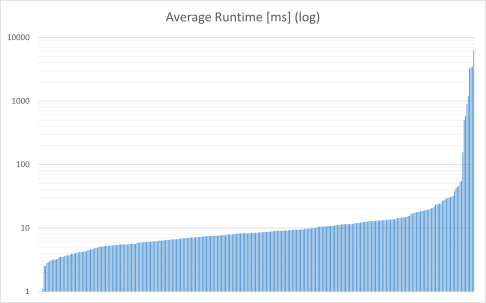
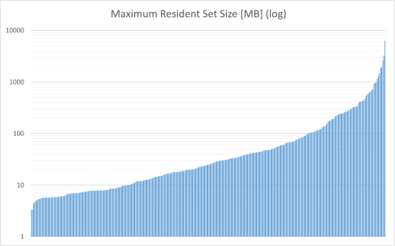

# Evaluation

The evaluation of the toolkit is done by using the newly constructed analysis from [Constructing a new Analysis].
This process is split into two parts, one focusing on the *qualitative* features, the other focusing on the *quantitative*.

## Qualitative Evaluation

The qualitative evaluation focuses on the ability of the toolkit to lift an analysis to more complex input programs than explicitly covered by the analysis implementation.
Non of the explicitly developed analyses components is dealing with function calls.
Yet, as we have used the mechanisms provided by the framework, no modifications are needed to make the analysis inter-procedural.
To show this, two additional test cases are constructed:

```{.txt .numberLines}
// case7.ir

def fun = function (arr : ref<ptr<int<4>>>) -> ptr<int<4>> {
	return ptr_add(*arr, 20);
};

{
	var ref<array<int<4>,21>> arr = ref_decl(type_lit(ref<array<int<4>,21>>));
	var ref<ptr<int<4>>> ap = fun(ptr_from_array(arr));
	*ptr_subscript(*ap, 10);
}
```

```{.txt .numberLines}
// case8.ir

def fun = function (arr : ref<ptr<int<4>>>) -> ptr<int<4>> {
	return ptr_add(*arr, 10);
};

{
	var ref<array<int<4>,21>> arr = ref_decl(type_lit(ref<array<int<4>,21>>));
	var ref<ptr<int<4>>> ap = fun(ptr_from_array(arr));
	*ptr_subscript(*ap, 10);
}
```


Note the different offset in line 2 (both cases).

For the `ref_deref` in line 8 (the first `*` operator in both cases), `IsOutOfBounds` must be returned by the analysis in Case 7, and `IsNotOutOfBounds` in Case 8.

We also provide two more test cases running the analysis on a scalar, instead of an array.

```{.txt .numberLines}
// case9.ir

{
	var ref<int<4>> a = ref_decl(type_lit(ref<int<4>>));
	var ref<ptr<int<4>>> ap = ptr_from_ref(a);
	*ptr_subscript(*ap, 42);
}
```

```{.txt .numberLines}
// case10.ir

{
	var ref<int<4>> a = ref_decl(type_lit(ref<int<4>>));
	var ref<ptr<int<4>>> ap = ptr_from_ref(a);
	*ptr_subscript(*ap, 0);
}
```

Case 9 should yield `IsOutOfBounds` while Case 10 should yield `IsNotOutOfBounds`.

As with the initial six cases in [Tests], Cases 7--10 are converted to unit tests and executed.

    $ ./ut_analysis_cba_haskell_out_of_bounds_analysis_test --gtest_filter=*AcrossFunctionCall*
    Running main() from gtest_main.cc
    Note: Google Test filter = *AcrossFunctionCall*
    [==========] Running 2 tests from 1 test case.
    [----------] Global test environment set-up.
    [----------] 2 tests from OutOfBounds
    [ RUN      ] OutOfBounds.AcrossFunctionCall
    [       OK ] OutOfBounds.AcrossFunctionCall (472 ms)
    [ RUN      ] OutOfBounds.AcrossFunctionCallNotOutOfBounds
    [       OK ] OutOfBounds.AcrossFunctionCallNotOutOfBounds (286 ms)
    [----------] 2 tests from OutOfBounds (758 ms total)

    [----------] Global test environment tear-down
    [==========] 2 tests from 1 test case ran. (759 ms total)
    [  PASSED  ] 2 tests.

    $ ./ut_analysis_cba_haskell_out_of_bounds_analysis_test --gtest_filter=*Scalar*
    Running main() from gtest_main.cc
    Note: Google Test filter = *Scalar*
    [==========] Running 2 tests from 1 test case.
    [----------] Global test environment set-up.
    [----------] 2 tests from OutOfBounds
    [ RUN      ] OutOfBounds.Scalar
    [       OK ] OutOfBounds.Scalar (456 ms)
    [ RUN      ] OutOfBounds.ScalarNotOutOfBounds
    [       OK ] OutOfBounds.ScalarNotOutOfBounds (281 ms)
    [----------] 2 tests from OutOfBounds (737 ms total)

    [----------] Global test environment tear-down
    [==========] 2 tests from 1 test case ran. (737 ms total)
    [  PASSED  ] 2 tests.

The new test cases pass, evincing that the framework indeed transparently integrates support for language features not explicitly covered.

## Quantitative Evaluation

For the quantitative evaluation we utilise Insieme's integration tests and run the out-of-bounds analysis on every `ref_deref` contained.
For this, we do not care about the actual result, but about the runtime.
This evaluates whether the analysis and framework provide sufficient enough performance.

As the integration tests are input files to the compiler, they are only available as C/C++ sources.
We therefore chose to create another driver (`haskell_dumper`) dedicated to reading C/C++ input files and dumping the binary representation of the corresponding INSPIRE program.
Next, this dump is read by another binary (`insieme-hat`) which then collects all node address of `ref_deref` calls and runs the out-of-bounds analysis on them.
To maximise modularity, the part for finding target nodes (in this case calls to `ref_deref`) and running the analysis is kept concise in dedicated functions.

```{.haskell .numberLines}
findTargets :: NodeAddress -> [NodeAddress] -> [NodeAddress]
findTargets addr xs = case getNode addr of
    IR.Node IR.CallExpr _ | Q.isBuiltin (goDown 1 addr) "ref_deref" -> addr : xs
    _ -> xs

analysis :: NodeAddress -> State SolverState OutOfBoundsResult
analysis addr = do
    state <- get
    let (res, state') = outOfBounds state addr
    put state'
    return res
```

The binary dump is read from `stdin` and each analysis run uses the `SolverState` outputted by the previous run.

```{.haskell .numberLines}
main :: IO ()
main = do
    -- parse binary dump (valid input expected)
    dump <- .getContents
    let Right ir = parseBinaryDump dump

    let targets = foldTreePrune findTargets Q.isType ir
    let res = evalState (sequence $ analysis <$> targets) initState

    start <- getCurrentTime
    evaluate $ force res
    end   <- getCurrentTime

    let ms = round $ (*1000) $ toRational $ diffUTCTime end start :: Integer
    printf "%d ms" ms
```

Note that in line 11 `res` is evaluated to normal form using `force` from the `deepseq` package.
This is necessary since Haskell features lazy-evaluation and `evaluate` will only evaluate the argument to weak head normal form^[See <https://wiki.haskell.org/Weak_head_normal_form> for more details.] (ie not fully).
`force` on the other hand evaluates the argument completely.

The evaluation is performed on an `Intel(R) Xeon(R) CPU E5-2699 v3 @ 2.30GHz` with 256 GB of memory.

Overall 320 integration tests have been used, containing about 3.81 x10^8^ nodes (not shared) altogether, from which 63 662 are calls to `ref_deref`.
To minimise measurement errors, each integration test is processed by `insieme-hat` 10 times from which the arithmetic mean of the outputted execution times is recorded.
The result is displayed in @fig:runtime_chart.
It shows that the majority of the test cases can be completed in under 30 ms.
The full list of integration tests (with the average execution time of the 10 runs) is provided in [Integration Tests].

{#fig:runtime_chart}

Furthermore, memory consumption has been recorded using `GNU time 1.7`.
@fig:memory_chart displays the recorded `Maximum Resident Set Size`.
The majority of test cases do not consume more than 100 MB of memory.

{#fig:memory_chart}
