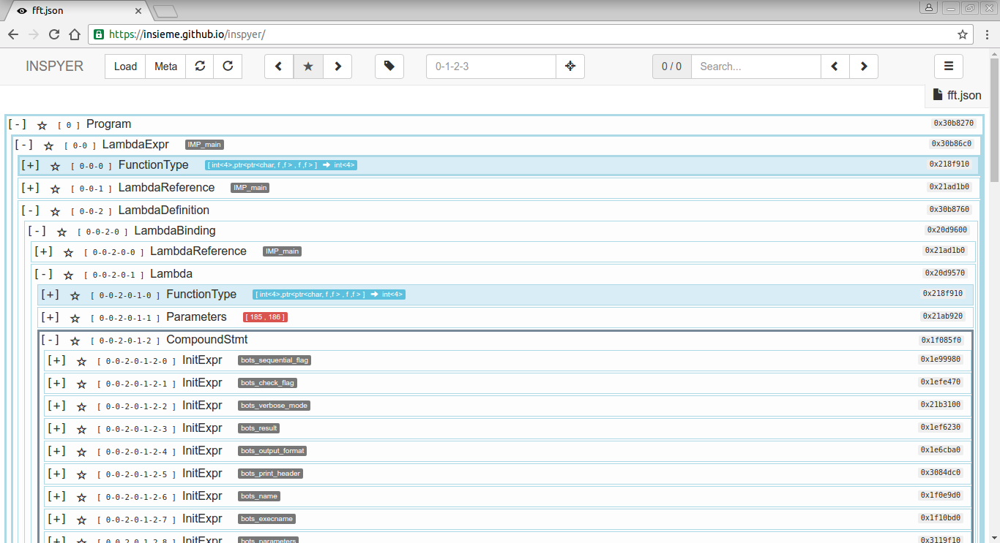

# Appendix A: INSPYER

The INSPYER tool was created to visualise a program represented in Insieme's Intermediate Representation (IR), also known as the INSieme Parallel Intermediate REpresentation (INSPIRE), in an interactive way.
Using the text representation of INSPIRE, as seen in [Semantics], is helpful for inspecting an INSPIRE program.
Yet it is a bit cumbersome to work with -- even when using an editor, like [Vim](http://www.vim.org), which supports code folding, jumping to corresponding closing brackets, and allows bookmarking locations.
The main idea is to have a Graphical User Interface (GUI) application which allows one to collapse subtrees which are not interesting and display useful information for each node in one line (ie row).
Navigation functions like *goto* and *search* are available as well.

{#fig:inspyer}

INSPYER is created as server-less web application using only HTML^[HyperText Markup Language], CSS^[Cascading Style Sheets], and JavaScript.
This allows for it to be run locally using a browser or even [host it online](https://insieme.github.io/inspyer) -- in our case we are using [GitHub Pages](https://pages.github.com).
[Bootstrap](http://getbootstrap.com), an HTML, CSS, and JavaScript framework is used to create the user interface in little time and to provide a pleasing look and feel.
A screenshot of INSPYER can be seen in @fig:inspyer where Insieme's FFT^[Fast Fourier Transformation] integration test has been loaded.

## JSON Export

An INSPIRE program is exported using Insieme's *JavaScript Object Notation (JSON) dumper*.
The format is straight forward and similar to the binary dump.
An example is given in the next code snippet.
The JSON object is required to have a field named `root` which identifies the root node.
Each Intermediate Representation (IR) node is attached to the object using a unique key, for simplicity the original memory address is used.
The information dumped for one node consists of the node type, its children and (in case its a value node) the value.
One can already see in the example, that the list of children is just a list of the memory locations of the child nodes.
The memory location serves as a unique identifier for each node.
This representation produces node sharing, similar to the binary dump.

```json
{
    "root" : "0x30b8270",
    "0x30b8270" : {
        "Kind" : "Program",
        "Children" : ["0x30b86c0"]
    },
    "0x30b86c0" : {
        "Kind" : "LambdaExpr",
        "Children" : ["0x218f910","0x21ad1b0","0x30b8760"]
    },
    "0x1f588f0" : {
        "Kind" : "StringValue",
        "Value" : "int",
        "Children" : []
    },
    ...
}
```

The user loads the JSON dump either by selecting it via the corresponding dialogue (using the button labelled *Load* located in the top bar) or by dragging and dropping the file into the main area of INSPYER.
Doing this will trigger the JavaScript logic, loading the file using `FileReader` and `JSON.parse`.
The JSON dump is then interpreted.
A class `Node`, dedicated for maintaining and working with nodes, has been implemented.
The tree visualisation is generated incrementally -- upon expanding a node, its children will be created.
This keeps the DOM^[Document Object Model] small and simple, which is important to provide adequate performance -- even small input programs can yield a big INSPIRE program.
Having more than 1 000 nodes displayed simultaneously results in an unresponsive (ie laggy) user experience.
This limitation is inherited by the browser.

## User Interface

The tree can be navigated either by using the mouse or the keyboard.
Clicking on a node will cause it to expand (or collapse if it is already expanded).
When using the keyboard, the currently *selected* node is outlined by a thicker, darker border.
Hitting <kbd>Space</kbd> will do the same to the selected node as clicking on it.
Other nodes can be selected by using the cursor keys to move the selection.\
<kbd><i class="fa fa-arrow-up"></i></kbd> and <kbd><i class="fa fa-arrow-down"></i></kbd> will change the selection on the current level of the tree.
<kbd><i class="fa fa-arrow-left"></i></kbd> moves the selection to the parent node.
<kbd><i class="fa fa-arrow-right"></i></kbd> selects the first child of the currently selected node, expanding it if necessary.

Each line, representing a node, consists of (from left to right):

- an indicator showing whether the node is expanded or collapsed;
- a bookmark button;
- the corresponding node address;
- the node type;
- its INSPIRE type\* (eg `int<4>`);
- its value\* (eg `9` or `"Hello"`;
- its variable id\*; and
- the unique identifier in form of the original memory location.

\* if available

The controls (navigation bar in @fig:inspyer) of INSPYER allow you to (again from left to right):

- load an INSPIRE program from a JSON dump;
- load meta information from a *meta file* (see [Meta Data]);
- reload the JSON dump and meta file (keeping bookmarks and search results);
- reload the JSON dump and meta file (clearing bookmarks and search results);
- move the selection back and forth between bookmarked nodes;
- show / hide node addresses -- useful deep inside the tree, where node addresses can get unpleasantly long;
- directly jump to a node given a node address;
- search the tree using a REGular EXpression (REGEX), jumping back and forth between results; and
- show a modal window containing information about hotkeys.

The modal window can be extended easily to hold more, infrequently used functions.
There are currently no such functions implemented, but may be needed in the future.
An example for this would be statistics about the currently loaded dump.

The search functionality is implemented using [web workers](https://developer.mozilla.org/en-US/docs/Web/API/Web_Workers_API/Using_web_workers).
This allows us to search the tree using a dedicated thread -- the GUI remains responsive even if it takes multiple seconds to search the whole tree.
The set of search results will be updated periodically so the user can inspect results matching the query before the search process is completed.

The FFT example contains 34 254 nodes and can be fully searched in about 15 seconds -- 'InitExpr' was used as search string, yielding 25 hits.
Note that the number of hits has a huge performance impact as each hit results in a new JavaScript object, which also has to be transferred from the web worker to the main thread.
Searching the FFT example for 'StringValue' yields over 2 500 000 results before the browser kills the main thread (and web worker).
This took about two minutes to happen.
These tests have been run on an `Intel(R) Core(TM) i3-3120M CPU @ 2.50GHz` with `16 GB DDR3 Memory @ 1600Hz` in `Chromium 51`.

The web worker API requires an external script file for the thread, but loading the script later on is not possible from a clients filesystem due to security concerns.
A workaround is to have the script embedded into the page and create a Binary Long OBject (BLOB) from it.
This BLOB will then be passed to the worker.
Therefore the logic of the search web worker is found in `index.html` at the bottom, inside a script tag with type `javascript/worker`.
It is important to set the type to something different from `text/javascript` to prevent the browser from executing this code right away.

## Meta Data

The *meta file* is a JSON formatted file that is associated with one JSON dump of an INSPIRE program and holds additional information.
Neither what kind of information can be contained nor where that information comes from is fixed.
The meta file can:

- bookmark specific nodes, the first bookmark will be jumped to on load;
- expand specific nodes;
- highlight specific nodes;
- attach labels to specific nodes; and
- attach multiline information (including markup), shown when a node is expanded.

As can be seen in the next code snippet, node addresses are used to reference the specific nodes.

```json
{
  "bookmarks": [
    "0-0-2-0-1-1",
    "0-0-2-0-1-2"
  ],
  "expands": [
    "0-0-2-0-1-2-1-0",
    "0-0-2-0-1-2-6-0",
    "0-0-2-0-1-2-12-0",
    "0-0-2-0-1-2-15-0"
  ],
  "labels": {
    "0-0-2-0-1-2-1": "some information",
    "0-0-2-0-1-2-3": "some other information"
  },
  "highlights": [
    "0-0-2-0-1-2-4",
    "0-0-2-0-1-2-5",
    "0-0-2-0-1-2-6",
    "0-0-2-0-1-2-7",
    "0-0-2-0-1-2-8"
  ],
  "bodies": {
    "0-0-2-0-1-2-6": "Some <b>additional</b> information text"
  }
}
```

Insieme maintains a helper class for generating meta files.
It is currently used in the analysis stress test and the module responsible for semantic checks.
The class declaration is displayed in the next code snippet.
One can manually instantiate this class, save the information and export it afterwards.

```cpp
class MetaGenerator {
  private:
	NodePtr root;
	std::set<NodeAddress> bookmarks;
	std::set<NodeAddress> expands;
	std::set<NodeAddress> highlights;
	std::map<NodeAddress, std::string> labels;
	std::map<NodeAddress, std::string> bodies;

	void checkRoot(const NodePtr root);

  public:
	explicit MetaGenerator(const NodePtr root);
	void addBookmark(const NodeAddress addr);
	void addExpand(const NodeAddress addr);
	void addHighlight(const NodeAddress addr);
	void addLabel(const NodeAddress addr, const std::string label);
	void addBody(const NodeAddress addr, const std::string body);
	void dump(std::ostream& out);
};
```

This, on the other hand, requires making the instance available at every point where information needs to be added -- and at the location where it should be exported.
Because of this, and since there usually only exists one INSPIRE program per run of the Insieme compiler, one static instance of the class and functions wrapping the default instance's functionality are provided.
The next code snippet shows these provided utility functions.

```cpp
void addBookmark(const NodeAddress addr);

void addExpand(const NodeAddress addr);

void addHighlight(const NodeAddress addr);

void addLabel(const NodeAddress addr, const std::string label);

void addBody(const NodeAddress addr, const std::string body);

void dumpTree(std::ostream& out, const NodePtr root);

void dumpMeta(std::ostream& out);
```
